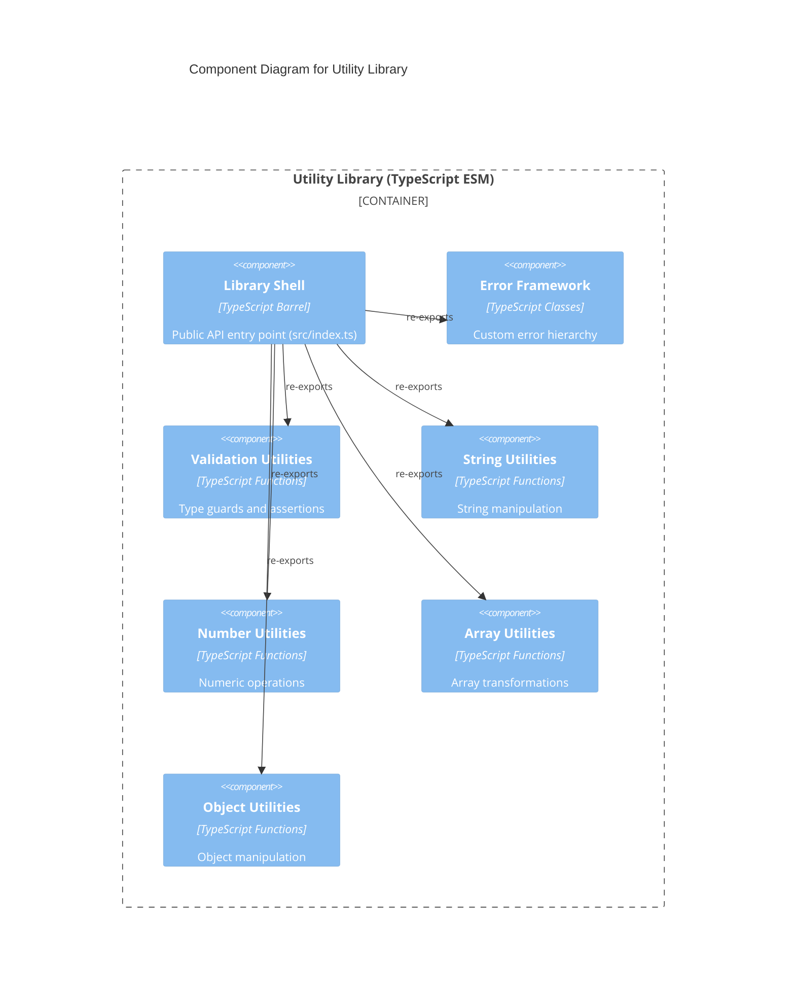

# C4 Component Level: Library Shell

## Overview

- **Name**: Library Shell
- **Description**: The public API entry point that aggregates and re-exports all utility functions and error classes from every submodule under a single import path.
- **Type**: Library
- **Technology**: TypeScript 5.x (ESM)

## Purpose

The Library Shell component is the face of the package as seen by external consumers. It contains `src/index.ts`, a barrel file that performs six wildcard re-exports — one for each utility submodule — making all 30 public symbols available from a single import statement. This allows callers to write `import { chunk, clamp, ValidationError } from 'auto-dev-test-target-1'` rather than navigating into individual submodule paths.

The Shell contains no business logic. Its sole responsibility is aggregation: ensuring that the exported names from each submodule are available at the package root and that there are no name collisions. It is the outermost layer of the library and depends on all other source components.

By isolating this aggregation concern in its own component, the Library Shell is clearly distinguished from the functional submodules. Adding, removing, or renaming an export requires a change only to the affected submodule barrel and this Shell — leaving the internal implementations untouched.

## Software Features

- **Unified import surface**: Exposes all 30 exported symbols (functions and classes) from a single module path
- **Deep-import compatibility**: Each submodule retains its own barrel (`src/array/index.ts`, etc.), so consumers may also import directly from submodule paths
- **Zero-logic aggregation**: The Shell contains only `export *` declarations and no implementation code

## Code Elements

This component contains:

- [c4-code-src.md](./c4-code-src.md) — Root barrel module (`src/index.ts`) that re-exports all six submodules

## Interfaces

### Package Entry Point (ESM named exports)

- **Protocol**: ES Module named exports
- **Description**: All public symbols from the utility library, available at the package root
- **Operations** (selected representative exports):
  - String: `capitalize`, `reverse`, `slugify`, `truncate`
  - Number: `clamp`, `roundTo`
  - Errors: `ValidationError`, `EmptyStringError`, `InvalidNumberError`, `OutOfRangeError`
  - Validation: `isNonEmptyString`, `isPositiveNumber`, `isInRange`, `isNonNegativeInteger`, `assertNonEmptyString`, `isPlainObject`
  - Array: `chunk`, `compact`, `first`, `last`, `unique`, `flatten`, `intersection`
  - Object: `clone`, `get`, `isEmpty`, `keys`, `merge`, `omit`, `pick`

## Dependencies

### Components Used

- **Error Framework**: Re-exports `ValidationError`, `EmptyStringError`, `InvalidNumberError`, `OutOfRangeError`
- **Validation Utilities**: Re-exports all six validation predicates and assertions
- **String Utilities**: Re-exports `capitalize`, `reverse`, `slugify`, `truncate`
- **Number Utilities**: Re-exports `clamp`, `roundTo`
- **Array Utilities**: Re-exports `chunk`, `compact`, `first`, `last`, `unique`, `flatten`, `intersection`
- **Object Utilities**: Re-exports `clone`, `get`, `isEmpty`, `keys`, `merge`, `omit`, `pick`

### External Systems

- TypeScript 5.x — `export *` re-export syntax
- Node.js 20.x — ESM module resolution

## Component Diagram

```mermaid
C4Component
    title Component Diagram for Utility Library

    Container_Boundary(lib, "Utility Library (TypeScript ESM)") {
        Component(shell, "Library Shell", "TypeScript Barrel", "Public API entry point (src/index.ts)")
        Component(errors, "Error Framework", "TypeScript Classes", "Custom error hierarchy")
        Component(validation, "Validation Utilities", "TypeScript Functions", "Type guards and assertions")
        Component(string, "String Utilities", "TypeScript Functions", "String manipulation")
        Component(number, "Number Utilities", "TypeScript Functions", "Numeric operations")
        Component(array, "Array Utilities", "TypeScript Functions", "Array transformations")
        Component(object, "Object Utilities", "TypeScript Functions", "Object manipulation")
    }

    Rel(shell, errors, "re-exports")
    Rel(shell, validation, "re-exports")
    Rel(shell, string, "re-exports")
    Rel(shell, number, "re-exports")
    Rel(shell, array, "re-exports")
    Rel(shell, object, "re-exports")
```
