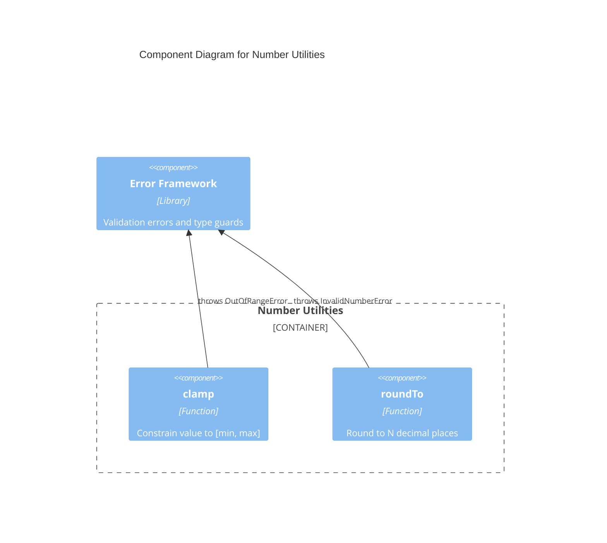

# C4 Component Level: Number Utilities

## Overview
- **Name**: Number Utilities
- **Description**: Provides validated numeric operations for clamping values to ranges and rounding to decimal places.
- **Type**: Library
- **Technology**: TypeScript

## Purpose

The Number Utilities component provides numeric transformation functions that enforce input validity through typed errors. It offers range-clamping and precision-rounding operations commonly needed when working with numerical data.

Both functions validate their inputs and throw specific error types from the Error Framework component, enabling callers to catch and handle validation failures precisely.

## Software Features
- **Range Clamping**: Constrain a number to an inclusive [min, max] range with boundary validation
- **Decimal Rounding**: Round to a specified number of decimal places using multiply-round-divide

## Code Elements

This component contains:
- [c4-code-number.md](./c4-code-number.md) — Number utility function implementations (clamp, roundTo)
- [c4-code-tests-number.md](./c4-code-tests-number.md) — Jest test suite covering clamp and roundTo with edge cases

## Interfaces

### Number Module API
- **Protocol**: Function calls (ESM exports)
- **Description**: Pure numeric functions importable from the library root or number sub-module
- **Operations**:
  - `clamp(value: number, min: number, max: number): number` — Constrain to [min, max] range
  - `roundTo(value: number, decimals: number): number` — Round to N decimal places

## Dependencies

### Components Used
- **Error Framework**: `clamp` throws `OutOfRangeError`; `roundTo` throws `InvalidNumberError`

### External Systems
- None

## Component Diagram

