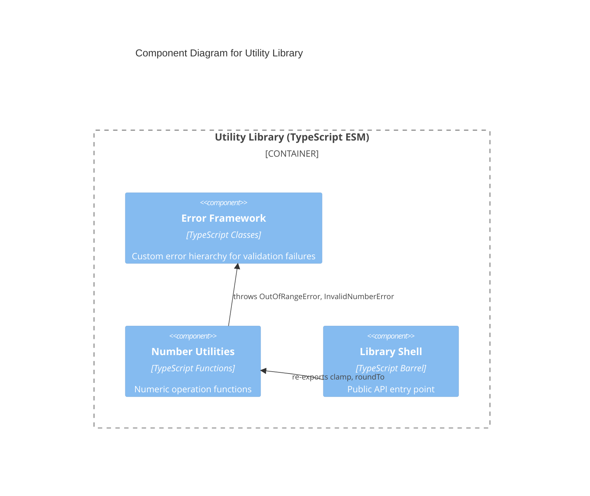

# C4 Component Level: Number Utilities

## Overview

- **Name**: Number Utilities
- **Description**: Validated numeric operation utilities for range clamping and decimal-place rounding.
- **Type**: Library
- **Technology**: TypeScript 5.x (ESM)

## Purpose

The Number Utilities component provides two foundational numeric operations that are needed frequently in application code: constraining a value to a range (`clamp`) and rounding to a specific number of decimal places (`roundTo`). Both functions include thorough input validation that surfaces meaningful typed errors rather than returning `NaN` or producing silent floating-point surprises.

`clamp` validates that the supplied range is logically consistent (min must not exceed max) and throws `OutOfRangeError` if not. `roundTo` validates that the `decimals` parameter is a non-negative integer and throws `InvalidNumberError` if it is not. The rounding implementation uses a power-of-10 multiplication approach to mitigate floating-point precision issues common with naive division-based rounding.

The component depends only on the Error Framework. It forms a leaf node in the dependency graph with no dependency on Validation Utilities.

## Software Features

- **Range clamping**: `clamp` constrains a number to `[min, max]`, returning `min` if below, `max` if above, or the value itself if within range
- **Decimal rounding**: `roundTo` rounds a number to a specified number of decimal places using a power-of-10 algorithm for floating-point safety
- **Validated inputs**: Both functions throw descriptive typed errors (`OutOfRangeError`, `InvalidNumberError`) for logically invalid parameter combinations

## Code Elements

This component contains:

- [c4-code-number.md](./c4-code-number.md) — Numeric utility functions (`clamp`, `roundTo`) at `src/number/`

## Interfaces

### Numeric Operation Functions (Function calls)

- **Protocol**: TypeScript function calls (synchronous, pure)
- **Description**: Validated numeric transformation functions
- **Operations**:
  - `clamp(value: number, min: number, max: number): number` — Constrains value to [min, max]; throws `OutOfRangeError` if min > max
  - `roundTo(value: number, decimals: number): number` — Rounds to given decimal places; throws `InvalidNumberError` if decimals is negative or non-integer

## Dependencies

### Components Used

- **Error Framework**: `OutOfRangeError` thrown by `clamp`; `InvalidNumberError` thrown by `roundTo`

### External Systems

- TypeScript 5.x — Type system
- ES2015+ — `Math.min`, `Math.max`, `Math.pow`, `Math.round`

## Component Diagram

```mermaid
C4Component
    title Component Diagram for Utility Library

    Container_Boundary(lib, "Utility Library (TypeScript ESM)") {
        Component(errors, "Error Framework", "TypeScript Classes", "Custom error hierarchy for validation failures")
        Component(number, "Number Utilities", "TypeScript Functions", "Numeric operation functions")
        Component(shell, "Library Shell", "TypeScript Barrel", "Public API entry point")
    }

    Rel(number, errors, "throws OutOfRangeError, InvalidNumberError")
    Rel(shell, number, "re-exports clamp, roundTo")
```
