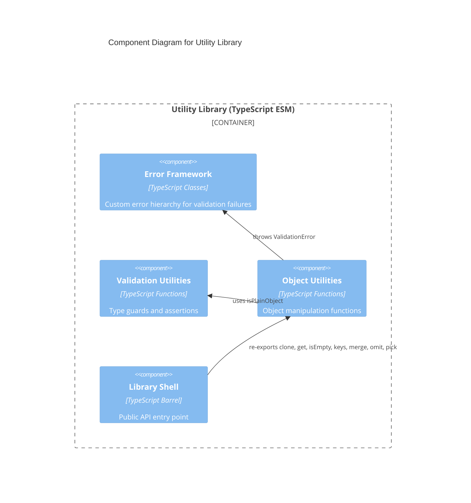

# C4 Component Level: Object Utilities

## Overview

- **Name**: Object Utilities
- **Description**: Type-safe functional utilities for deep cloning, nested property access, emptiness detection, key extraction, deep merging, and property selection/exclusion on JavaScript objects.
- **Type**: Library
- **Technology**: TypeScript 5.x (ESM)

## Purpose

The Object Utilities component provides seven operations that cover the most common needs when working with JavaScript objects in a type-safe way. The functions address four distinct concerns: introspection (`isEmpty`, `keys`), deep copying (`clone`), structured access (`get`), mutation-free transformation (`pick`, `omit`), and recursive merging (`merge`).

`clone` uses the ES2022 `structuredClone` API for reliable deep copying and adds a pre-flight validation step that throws `ValidationError` for non-serializable values (functions and symbols). `merge` uses the `isPlainObject` predicate from Validation Utilities to detect whether a property value should be recursively merged or simply overwritten. The remaining five functions (`get`, `isEmpty`, `keys`, `pick`, `omit`) are pure with no internal dependencies.

The component depends on both the Error Framework and Validation Utilities, placing it at the same dependency level as Array Utilities.

## Software Features

- **Deep cloning**: `clone` creates a structurally independent deep copy via `structuredClone`, rejecting functions and symbols with `ValidationError`
- **Nested property access**: `get` safely traverses dot-notation path strings, returning `undefined` or a provided default value for missing or null intermediate nodes
- **Emptiness detection**: `isEmpty` identifies null, undefined, empty strings, empty arrays, and empty plain objects
- **Type-safe key extraction**: `keys` wraps `Object.keys` to preserve the literal key type information on the return value
- **Deep merging**: `merge` recursively merges source objects into a target, using plain-object detection to decide between deep merge and shallow overwrite; arrays are merged by index
- **Property exclusion**: `omit` returns a new object with specified keys removed
- **Property selection**: `pick` returns a new object containing only the specified keys

## Code Elements

This component contains:

- [c4-code-object.md](./c4-code-object.md) — Object manipulation functions (`clone`, `get`, `isEmpty`, `keys`, `merge`, `omit`, `pick`) at `src/object/`

## Interfaces

### Object Manipulation Functions (Function calls)

- **Protocol**: TypeScript function calls (synchronous, pure)
- **Description**: Typed object utility functions with generic type preservation
- **Operations**:
  - `clone<T>(obj: T): T` — Deep clones any value; throws `ValidationError` for functions or symbols
  - `get(obj: unknown, path: string, defaultValue?: unknown): unknown` — Retrieves nested property by dot-notation path
  - `isEmpty(value: unknown): boolean` — Returns true if value is null, undefined, empty string, empty array, or empty plain object
  - `keys<T extends object>(obj: T): (keyof T)[]` — Returns typed array of own enumerable keys
  - `merge<T extends Record<string, unknown>>(target: T, ...sources: Partial<T>[]): T` — Deep merges sources into target
  - `omit<T extends Record<string, unknown>, K extends keyof T>(obj: T, keys: K[]): Omit<T, K>` — Excludes specified keys
  - `pick<T extends Record<string, unknown>, K extends keyof T>(obj: T, keys: K[]): Pick<T, K>` — Includes only specified keys

## Dependencies

### Components Used

- **Error Framework**: `ValidationError` thrown by `clone` when value contains functions or symbols
- **Validation Utilities**: `isPlainObject` used by `merge` to determine whether to recurse or overwrite

### External Systems

- TypeScript 5.x — Generic type parameters, `keyof`, `Omit`, `Pick` mapped types
- ES2022+ — `structuredClone` built-in API
- ES2015+ — `Object.keys`, `Object.getPrototypeOf`, `Object.prototype`

## Component Diagram

