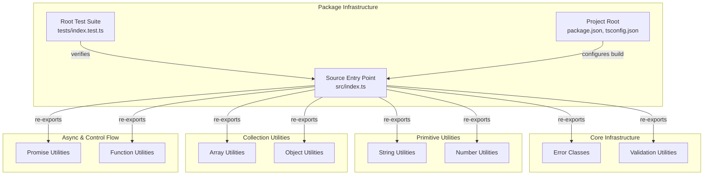

# C4 Component: Package Infrastructure

## Overview

The Package Infrastructure component contains the project configuration, build setup, and the main barrel export entry point. It defines how the library is built, published, and consumed.

## Purpose

Provides the NPM package manifest, TypeScript compiler configuration, and the single entry point that re-exports all utilities from every module. This component is the consumer-facing surface of the library.

## Software Features

- **Package Configuration**: NPM metadata, version, scripts (build, test, lint), and dependency declarations
- **TypeScript Build Setup**: ES2022 target, NodeNext module resolution, strict mode, declaration output
- **Barrel Export**: Single `src/index.ts` entry point re-exporting all 8 utility modules
- **Smoke Testing**: Root-level test validating the barrel export works correctly

## Code Elements

| Code Element | Location | Description |
|---|---|---|
| [Project Root](c4-code-root.md) | `.` | package.json and tsconfig.json configuration |
| [Source Entry Point](c4-code-src.md) | `src` | Main barrel export re-exporting all modules |
| [Root Test Suite](c4-code-tests.md) | `tests` | 1 smoke test verifying root exports |

## Interfaces

### Package Entry Point (`src/index.ts`)

```typescript
// Re-exports all public APIs from:
export * from './string/index.js';
export * from './number/index.js';
export * from './errors/index.js';
export * from './validation/index.js';
export * from './array/index.js';
export * from './object/index.js';
export * from './promise/index.js';
export * from './function/index.js';
```

### Build Scripts (`package.json`)

```json
{
  "scripts": {
    "build": "tsc",
    "test": "jest",
    "lint": "echo \"lint placeholder\""
  }
}
```

## Dependencies

### Internal Dependencies
- src → string, number, errors, validation, array, object, promise, function (re-exports all)

### External Dependencies
- **typescript** ^5.3.0 — TypeScript compiler
- **jest** ^30.2.0 — Test runner
- **ts-jest** ^29.4.6 — TypeScript Jest transformer
- **@types/jest** ^30.0.0 — Jest type definitions
- **@types/node** ^20.10.0 — Node.js type definitions

## Component Diagram


