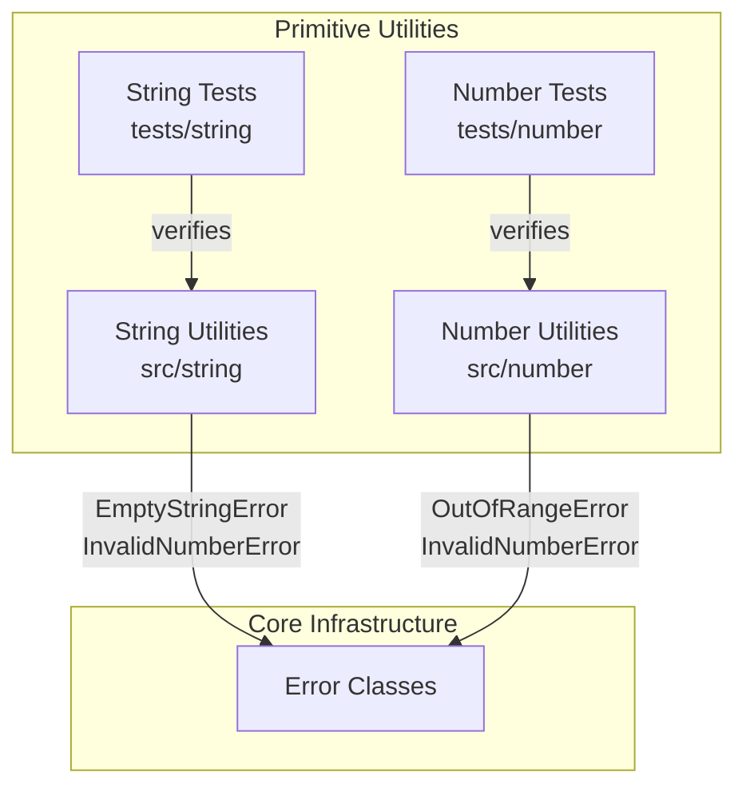

# C4 Component: Primitive Utilities

## Overview

The Primitive Utilities component provides transformation and manipulation functions for JavaScript primitive types: strings and numbers. These are stateless, pure functions that transform individual values.

## Purpose

Offers commonly-needed operations on primitive values including string formatting (capitalize, slugify, reverse, truncate) and numeric manipulation (clamping to ranges, rounding to decimal places). All functions validate inputs using the Core Infrastructure component.

## Software Features

- **String Transformation**: Reverse, truncate with configurable suffix, URL-safe slug generation, capitalization
- **Numeric Manipulation**: Value clamping to inclusive ranges, decimal rounding with precision control
- **Input Validation**: Throws typed errors (EmptyStringError, InvalidNumberError, OutOfRangeError) for invalid parameters

## Code Elements

| Code Element | Location | Description |
|---|---|---|
| [String Utilities](c4-code-string.md) | `src/string` | 4 string functions: reverse, truncate, slugify, capitalize |
| [Number Utilities](c4-code-number.md) | `src/number` | 2 number functions: clamp, roundTo |
| [String Utility Tests](c4-code-tests-string.md) | `tests/string` | 20 tests across 4 test suites |
| [Number Utility Tests](c4-code-tests-number.md) | `tests/number` | 12 tests across 2 test suites |

## Interfaces

### String Functions (`src/string`)

```typescript
function reverse(str: string): string;
function truncate(str: string, maxLength: number, suffix?: string): string;
function slugify(str: string): string;
function capitalize(str: string): string;
```

### Number Functions (`src/number`)

```typescript
function clamp(value: number, min: number, max: number): number;
function roundTo(value: number, decimals: number): number;
```

## Dependencies

### Internal Dependencies
- string → errors: `EmptyStringError`, `InvalidNumberError` (used by `truncate`)
- number → errors: `OutOfRangeError` (used by `clamp`), `InvalidNumberError` (used by `roundTo`)

### External Dependencies
- None

## Component Diagram


