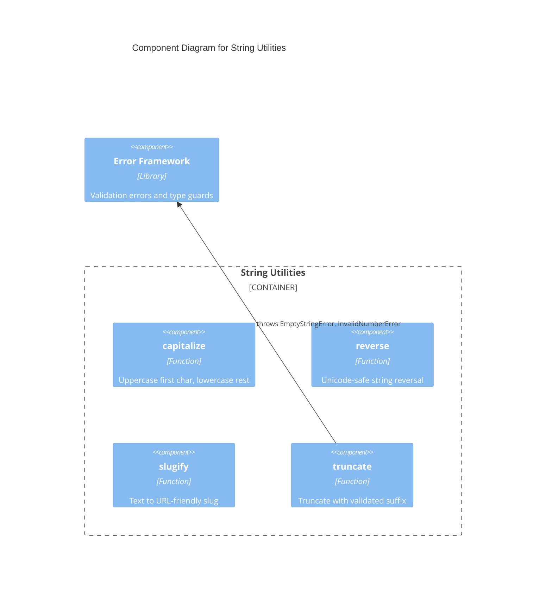

# C4 Component Level: String Utilities

## Overview
- **Name**: String Utilities
- **Description**: Provides reusable string transformation functions for common text manipulation operations.
- **Type**: Library
- **Technology**: TypeScript

## Purpose

The String Utilities component encapsulates all string transformation operations offered by the library. It provides functions for capitalizing text, reversing strings, converting to URL-friendly slugs, and truncating with configurable suffixes.

These functions handle edge cases like empty strings and Unicode characters. The truncate function integrates with the Error Framework component for input validation, throwing typed errors when parameters are invalid.

## Software Features
- **Capitalization**: Uppercase first character with rest lowercased
- **Reversal**: Unicode-safe string reversal using spread-reverse-join
- **Slugification**: Convert arbitrary text to URL-friendly hyphenated slugs
- **Truncation**: Length-limited text with configurable suffix and validated parameters

## Code Elements

This component contains:
- [c4-code-string.md](./c4-code-string.md) — String utility function implementations (capitalize, reverse, slugify, truncate)
- [c4-code-tests-string.md](./c4-code-tests-string.md) — Jest test suite covering all string functions with edge cases

## Interfaces

### String Module API
- **Protocol**: Function calls (ESM exports)
- **Description**: Pure string transformation functions importable from the library root or string sub-module
- **Operations**:
  - `capitalize(str: string): string` — Uppercase first char, lowercase rest
  - `reverse(str: string): string` — Reverse a string (Unicode-safe)
  - `slugify(str: string): string` — Convert to URL-friendly slug
  - `truncate(str: string, maxLength: number, suffix?: string): string` — Truncate with suffix

## Dependencies

### Components Used
- **Error Framework**: `truncate` throws `EmptyStringError` and `InvalidNumberError` on invalid input

### External Systems
- None

## Component Diagram

