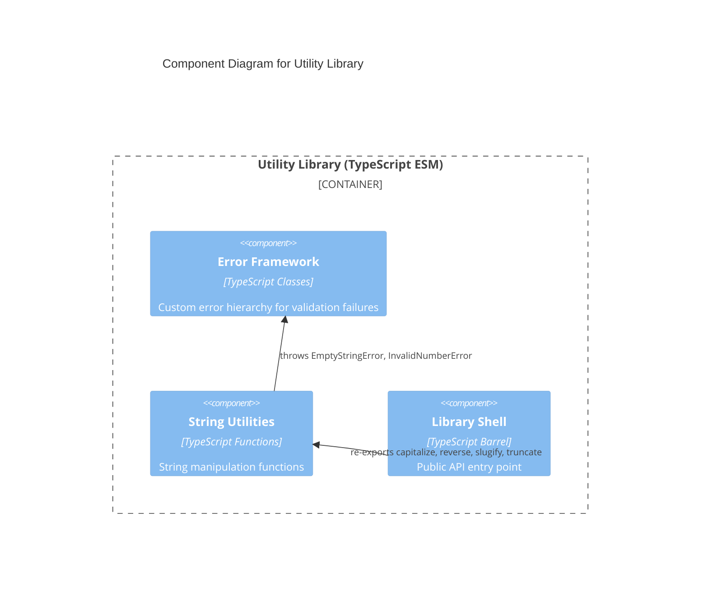

# C4 Component Level: String Utilities

## Overview

- **Name**: String Utilities
- **Description**: Pure functional string manipulation utilities for capitalization, reversal, URL slug generation, and length-bounded truncation.
- **Type**: Library
- **Technology**: TypeScript 5.x (ESM)

## Purpose

The String Utilities component delivers the library's string transformation capabilities. It provides four commonly-needed string operations that cover text normalization (`capitalize`), display truncation (`truncate`), URL-safe slug generation (`slugify`), and character reversal (`reverse`).

Three of the four functions (`capitalize`, `reverse`, `slugify`) are fully pure with no dependencies — they operate solely on the input string using built-in JavaScript string methods and regex. The fourth, `truncate`, adds parameter validation via the Error Framework to reject empty suffix strings and invalid maxLength values, giving callers descriptive typed errors rather than silent incorrect output.

The component depends only on the Error Framework. It does not depend on Validation Utilities, meaning it forms a leaf node in the dependency graph alongside Number Utilities.

## Software Features

- **Capitalization**: Uppercases the first character and lowercases all remaining characters
- **String reversal**: Reverses a string character-by-character using array spread, handling multi-code-unit Unicode characters correctly
- **URL slug generation**: Converts arbitrary strings to lowercase hyphen-separated URL-safe slugs by removing special characters and normalizing runs of hyphens
- **Bounded truncation**: Truncates strings to a maximum length with a configurable suffix, validating that the suffix is non-empty and that maxLength is a positive integer

## Code Elements

This component contains:

- [c4-code-string.md](./c4-code-string.md) — String transformation functions (`capitalize`, `reverse`, `slugify`, `truncate`) at `src/string/`

## Interfaces

### String Transformation Functions (Function calls)

- **Protocol**: TypeScript function calls (synchronous, pure)
- **Description**: Stateless string transformation functions
- **Operations**:
  - `capitalize(str: string): string` — Uppercases first char, lowercases the rest
  - `reverse(str: string): string` — Reverses a string, Unicode-safe
  - `slugify(str: string): string` — Converts to lowercase hyphen-separated URL slug
  - `truncate(str: string, maxLength: number, suffix?: string): string` — Truncates with suffix; throws `EmptyStringError` or `InvalidNumberError` for invalid params

## Dependencies

### Components Used

- **Error Framework**: `EmptyStringError` and `InvalidNumberError` thrown by `truncate` for invalid input

### External Systems

- TypeScript 5.x — Type system
- ES2015+ — Native `String` methods, regular expressions

## Component Diagram

```mermaid
C4Component
    title Component Diagram for Utility Library

    Container_Boundary(lib, "Utility Library (TypeScript ESM)") {
        Component(errors, "Error Framework", "TypeScript Classes", "Custom error hierarchy for validation failures")
        Component(string, "String Utilities", "TypeScript Functions", "String manipulation functions")
        Component(shell, "Library Shell", "TypeScript Barrel", "Public API entry point")
    }

    Rel(string, errors, "throws EmptyStringError, InvalidNumberError")
    Rel(shell, string, "re-exports capitalize, reverse, slugify, truncate")
```
