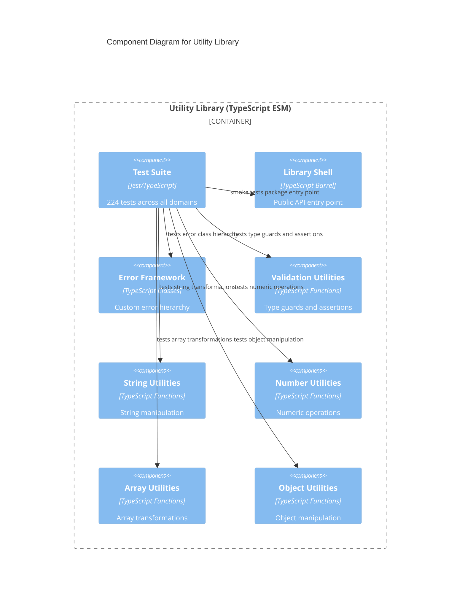

# C4 Component Level: Test Suite

## Overview

- **Name**: Test Suite
- **Description**: Comprehensive Jest test coverage for all source components, organized by domain to mirror the source directory structure.
- **Type**: Test Infrastructure
- **Technology**: TypeScript 5.x, Jest 29+, ts-jest

## Purpose

The Test Suite component contains all 224 test cases that verify the correctness of the library. It is organized into seven subdirectories that map one-to-one onto the source modules they exercise: `tests/errors/`, `tests/validation/`, `tests/string/`, `tests/number/`, `tests/array/`, `tests/object/`, and a root-level `tests/index.test.ts`.

Each subdirectory is a self-contained collection of Jest test files focused on a single source domain. Tests import from `src/index.js` (the compiled output) to validate the full export pipeline as well as from direct source paths to exercise module internals. The root `tests/index.test.ts` acts as a smoke test that validates the package entry point is correctly wired.

The Test Suite has no runtime role — it is a development and CI artifact only. It is not deployed and does not influence the library's public API. Its dependency graph mirrors the source graph: error tests import error classes; validation tests import validators and error classes; domain tests (string, number, array, object) import their respective source modules and the error classes those modules throw.

## Software Features

- **Error class tests** (`tests/errors/`): 28 tests verifying all four error classes — instantiation, inheritance chain, `name` and `field` properties, and message formatting
- **Validation tests** (`tests/validation/`): 31 tests covering all six predicates and the assertion function, including edge cases for prototype chain detection
- **String tests** (`tests/string/`): 20 tests for all four string functions, including Unicode handling and error conditions
- **Number tests** (`tests/number/`): 12 tests for `clamp` and `roundTo`, covering boundary conditions and error conditions
- **Array tests** (`tests/array/`): 53 tests across seven test files for all seven array functions, including NaN/Set edge cases
- **Object tests** (`tests/object/`): 95 tests across seven test files for all seven object functions, including circular reference and prototype chain scenarios
- **Package integration test** (`tests/index.test.ts`): 1 smoke test verifying the root export chain is correctly configured

## Code Elements

This component contains:

- [c4-code-tests.md](./c4-code-tests.md) — Root test entry point (`tests/index.test.ts`), 1 integration test
- [c4-code-tests-errors.md](./c4-code-tests-errors.md) — Error class tests (`tests/errors/`), 28 tests
- [c4-code-tests-validation.md](./c4-code-tests-validation.md) — Validation utility tests (`tests/validation/`), 31 tests
- [c4-code-tests-string.md](./c4-code-tests-string.md) — String utility tests (`tests/string/`), 20 tests
- [c4-code-tests-number.md](./c4-code-tests-number.md) — Number utility tests (`tests/number/`), 12 tests
- [c4-code-tests-array.md](./c4-code-tests-array.md) — Array utility tests (`tests/array/`), 53 tests
- [c4-code-tests-object.md](./c4-code-tests-object.md) — Object utility tests (`tests/object/`), 95 tests

## Interfaces

This component exposes no public interface. It is invoked via the Jest test runner.

### Test Execution (CLI)

- **Protocol**: Shell command
- **Description**: Executes the full test suite via npm scripts
- **Operations**:
  - `npm test` — Runs all 224 tests across all directories
  - `npm test -- tests/array` — Runs only the array subdirectory tests
  - `npm test -- --verbose` — Runs with per-test output

## Dependencies

### Components Used

- **Library Shell**: Root smoke test imports from the package entry point
- **Error Framework**: Error class tests import directly from `src/errors/`; all other tests import error classes for `toThrow` assertions
- **Validation Utilities**: Validation tests import from `src/validation/`
- **String Utilities**: String tests import from `src/string/`
- **Number Utilities**: Number tests import from `src/number/`
- **Array Utilities**: Array tests import from `src/array/`
- **Object Utilities**: Object tests import from `src/object/`

### External Systems

- Jest 29+ — Test runner, assertion library, and test discovery
- ts-jest — TypeScript compilation plugin for Jest
- TypeScript 5.x — Test file type checking and compilation
- Node.js 20.x — ESM module execution environment

## Component Diagram

