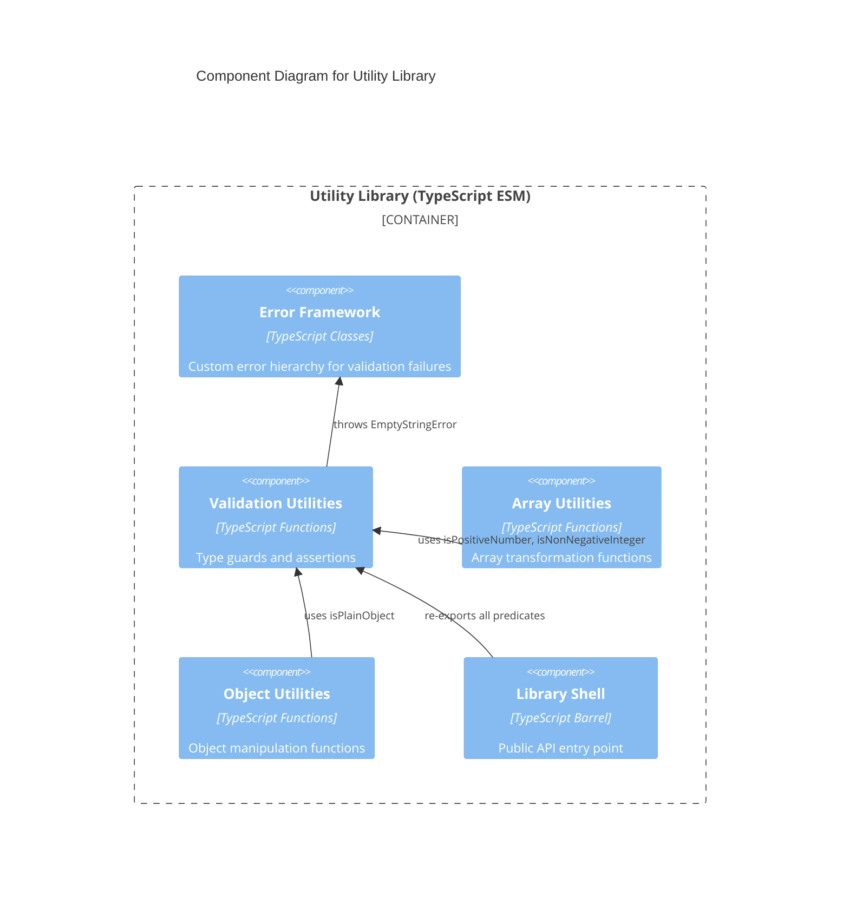

# C4 Component Level: Validation Utilities

## Overview

- **Name**: Validation Utilities
- **Description**: Runtime type guards and assertion functions for defensive validation of values passed into the library's public API.
- **Type**: Library
- **Technology**: TypeScript 5.x (ESM)

## Purpose

The Validation Utilities component provides the type-guard and assertion primitives that allow other components to perform safe runtime checks before operating on their inputs. Because TypeScript's type system is erased at runtime, these functions fill the gap by enabling code to verify at execution time that values conform to expected shapes and constraints.

Two usage patterns are supported: predicate functions (`is*`) return a boolean and narrow the TypeScript type in the calling scope; assertion functions (`assert*`) throw a typed error if the value is invalid, and TypeScript understands the type has been narrowed past the assertion call. This dual interface covers both conditional branching and early-exit validation patterns.

The component sits above the Error Framework (its only dependency) and below the Array and Object Utilities components that consume its predicates.

## Software Features

- **Non-empty string guard**: `isNonEmptyString` type predicate that narrows `unknown` to `string`
- **Positive number guard**: `isPositiveNumber` type predicate rejecting zero, negatives, and non-finite values
- **Range check**: `isInRange` predicate for inclusive range membership (does not narrow the type, returns boolean)
- **Non-negative integer guard**: `isNonNegativeInteger` type predicate for integer validation
- **String assertion**: `assertNonEmptyString` assertion function that throws `EmptyStringError` and narrows the type post-call
- **Plain object guard**: `isPlainObject` type predicate distinguishing literal objects from arrays, class instances, Date, RegExp, Map, and Set

## Code Elements

This component contains:

- [c4-code-validation.md](./c4-code-validation.md) — Type guard predicates and assertion functions at `src/validation/`

## Interfaces

### Validation Predicates and Assertions (Function calls)

- **Protocol**: TypeScript function calls (synchronous, pure)
- **Description**: Type-narrowing predicates and assertion functions for runtime validation
- **Operations**:
  - `isNonEmptyString(value: unknown): value is string` — True if value is a non-empty string
  - `isPositiveNumber(value: unknown): value is number` — True if value is a positive finite number
  - `isInRange(value: number, min: number, max: number): boolean` — True if value is within [min, max]
  - `isNonNegativeInteger(value: unknown): value is number` — True if value is a non-negative integer
  - `assertNonEmptyString(value: unknown, field?: string): asserts value is string` — Throws `EmptyStringError` if invalid
  - `isPlainObject(value: unknown): value is Record<string, unknown>` — True if value is a plain object literal

## Dependencies

### Components Used

- **Error Framework**: `EmptyStringError` thrown by `assertNonEmptyString` when validation fails

### External Systems

- TypeScript 5.x — Type guard syntax (`value is Type`, `asserts value is Type`)
- ES2015+ — `Object.getPrototypeOf`, `Object.prototype`, `Number.isFinite`, `Number.isInteger`

## Component Diagram

