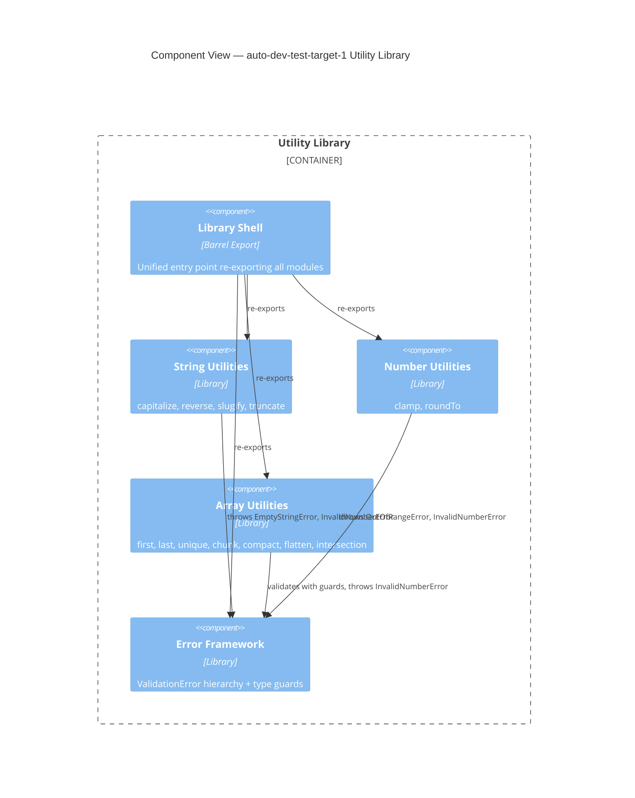

# C4 Component Level: System Overview

## System Components

| Component | Description | Code Elements | Documentation |
|-----------|-------------|---------------|---------------|
| String Utilities | String transformation functions (capitalize, reverse, slugify, truncate) | 2 files | [c4-component-string-utilities.md](./c4-component-string-utilities.md) |
| Number Utilities | Numeric operations (clamp, roundTo) with validated input | 2 files | [c4-component-number-utilities.md](./c4-component-number-utilities.md) |
| Array Utilities | Generic array manipulation (chunk, flatten, unique, compact, etc.) | 2 files | [c4-component-array-utilities.md](./c4-component-array-utilities.md) |
| Error Framework | Cross-cutting error hierarchy and runtime validation guards | 4 files | [c4-component-error-framework.md](./c4-component-error-framework.md) |
| Library Shell | Entry point barrel export and test infrastructure | 2 files | [c4-component-library-shell.md](./c4-component-library-shell.md) |

## Component Relationships

## Component-to-Code Mapping

| Code File | Component |
|-----------|-----------|
| c4-code-string.md | String Utilities |
| c4-code-tests-string.md | String Utilities |
| c4-code-number.md | Number Utilities |
| c4-code-tests-number.md | Number Utilities |
| c4-code-array.md | Array Utilities |
| c4-code-tests-array.md | Array Utilities |
| c4-code-errors.md | Error Framework |
| c4-code-validation.md | Error Framework |
| c4-code-tests-errors.md | Error Framework |
| c4-code-tests-validation.md | Error Framework |
| c4-code-src.md | Library Shell |
| c4-code-tests.md | Library Shell |
