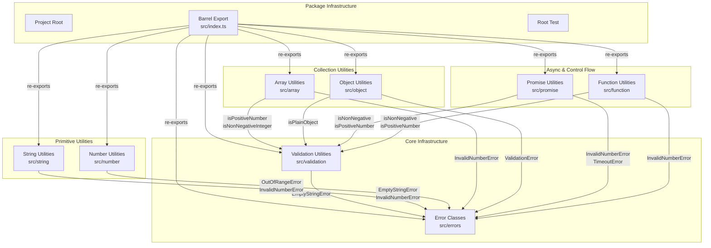

# C4 Component Level: auto-dev-test-target-1

## System Components

| Component | Description | Code Elements | Key Interfaces |
|---|---|---|---|
| [Core Infrastructure](c4-component-core.md) | Error hierarchy and validation utilities | 4 (errors, validation + tests) | 5 error classes, 7 validation functions |
| [Primitive Utilities](c4-component-primitives.md) | String and number transformations | 4 (string, number + tests) | 4 string functions, 2 number functions |
| [Collection Utilities](c4-component-collections.md) | Array and object manipulation | 4 (array, object + tests) | 7 array functions, 7 object functions |
| [Async & Control Flow](c4-component-async.md) | Promise helpers and function wrappers | 4 (promise, function + tests) | 3 promise functions, 3 function wrappers |
| [Package Infrastructure](c4-component-package.md) | Build config and barrel export | 3 (root, src + root test) | 1 barrel export, 3 build scripts |

**Total**: 5 components, 19 code-level elements, 285 tests

## Component Relationships


```mermaid
graph TB
    subgraph pkg["Package Infrastructure"]
        root["Project Root"]
        src["Barrel Export<br/>src/index.ts"]
        rootTest["Root Test"]
    end

    subgraph core["Core Infrastructure"]
        errors["Error Classes<br/>src/errors"]
        validation["Validation Utilities<br/>src/validation"]
    end

    subgraph primitives["Primitive Utilities"]
        string["String Utilities<br/>src/string"]
        number["Number Utilities<br/>src/number"]
    end

    subgraph collections["Collection Utilities"]
        array["Array Utilities<br/>src/array"]
        object["Object Utilities<br/>src/object"]
    end

    subgraph async["Async & Control Flow"]
        promise["Promise Utilities<br/>src/promise"]
        func["Function Utilities<br/>src/function"]
    end

    src -->|"re-exports"| errors
    src -->|"re-exports"| validation
    src -->|"re-exports"| string
    src -->|"re-exports"| number
    src -->|"re-exports"| array
    src -->|"re-exports"| object
    src -->|"re-exports"| promise
    src -->|"re-exports"| func

    validation -->|"EmptyStringError"| errors

    string -->|"EmptyStringError<br/>InvalidNumberError"| errors
    number -->|"OutOfRangeError<br/>InvalidNumberError"| errors

    array -->|"InvalidNumberError"| errors
    array -->|"isPositiveNumber<br/>isNonNegativeInteger"| validation
    object -->|"ValidationError"| errors
    object -->|"isPlainObject"| validation

    promise -->|"InvalidNumberError<br/>TimeoutError"| errors
    promise -->|"isNonNegative<br/>isPositiveNumber"| validation
    func -->|"InvalidNumberError"| errors
    func -->|"isNonNegative<br/>isPositiveNumber"| validation
```

## Full Dependency Graph

All utility components depend on Core Infrastructure. No cross-dependencies exist between peer utility components.

| From | To | Dependency Type |
|---|---|---|
| Package Infrastructure | All components | Re-exports via barrel |
| Primitive Utilities | Core Infrastructure | Error classes |
| Collection Utilities | Core Infrastructure | Error classes + validation functions |
| Async & Control Flow | Core Infrastructure | Error classes + validation functions |
| Core (validation) | Core (errors) | EmptyStringError |

### Dependency Direction

```
Package Infrastructure (barrel export)
    |
    +-- Core Infrastructure (errors, validation)
    |       ^        ^          ^
    |       |        |          |
    +-- Primitive    |          |
    |   Utilities    |          |
    |                |          |
    +-- Collection   +----------+
    |   Utilities
    |                |
    +-- Async &      +
        Control Flow
```

## Component-to-Code Mapping

### Core Infrastructure
| Code Element | File |
|---|---|
| [c4-code-errors](c4-code-errors.md) | `src/errors/index.ts` |
| [c4-code-validation](c4-code-validation.md) | `src/validation/index.ts` |
| [c4-code-tests-errors](c4-code-tests-errors.md) | `tests/errors/index.test.ts` |
| [c4-code-tests-validation](c4-code-tests-validation.md) | `tests/validation/index.test.ts` |

### Primitive Utilities
| Code Element | File |
|---|---|
| [c4-code-string](c4-code-string.md) | `src/string/*.ts` |
| [c4-code-number](c4-code-number.md) | `src/number/*.ts` |
| [c4-code-tests-string](c4-code-tests-string.md) | `tests/string/*.test.ts` |
| [c4-code-tests-number](c4-code-tests-number.md) | `tests/number/*.test.ts` |

### Collection Utilities
| Code Element | File |
|---|---|
| [c4-code-array](c4-code-array.md) | `src/array/*.ts` |
| [c4-code-object](c4-code-object.md) | `src/object/*.ts` |
| [c4-code-tests-array](c4-code-tests-array.md) | `tests/array/*.test.ts` |
| [c4-code-tests-object](c4-code-tests-object.md) | `tests/object/*.test.ts` |

### Async & Control Flow
| Code Element | File |
|---|---|
| [c4-code-promise](c4-code-promise.md) | `src/promise/*.ts` |
| [c4-code-function](c4-code-function.md) | `src/function/*.ts` |
| [c4-code-tests-promise](c4-code-tests-promise.md) | `tests/promise/*.test.ts` |
| [c4-code-tests-function](c4-code-tests-function.md) | `tests/function/*.test.ts` |

### Package Infrastructure
| Code Element | File |
|---|---|
| [c4-code-root](c4-code-root.md) | `package.json`, `tsconfig.json` |
| [c4-code-src](c4-code-src.md) | `src/index.ts` |
| [c4-code-tests](c4-code-tests.md) | `tests/index.test.ts` |
