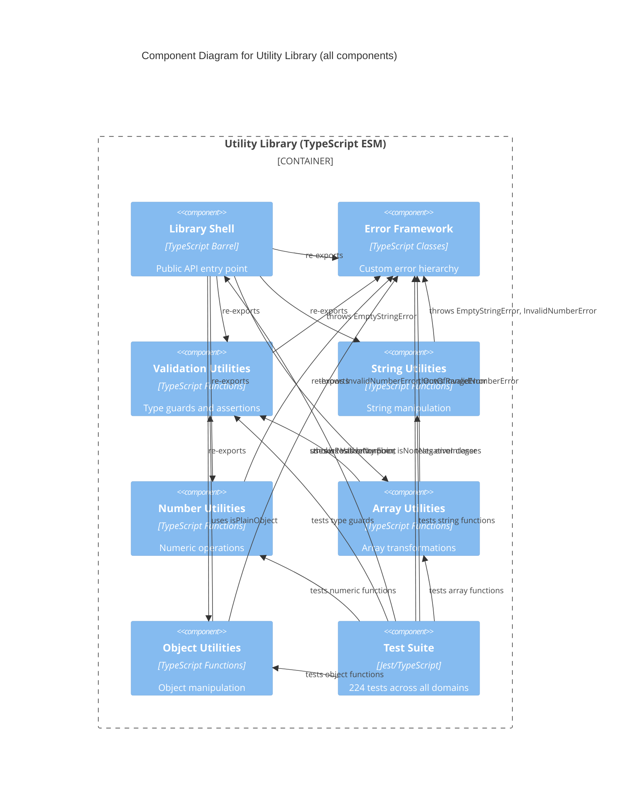
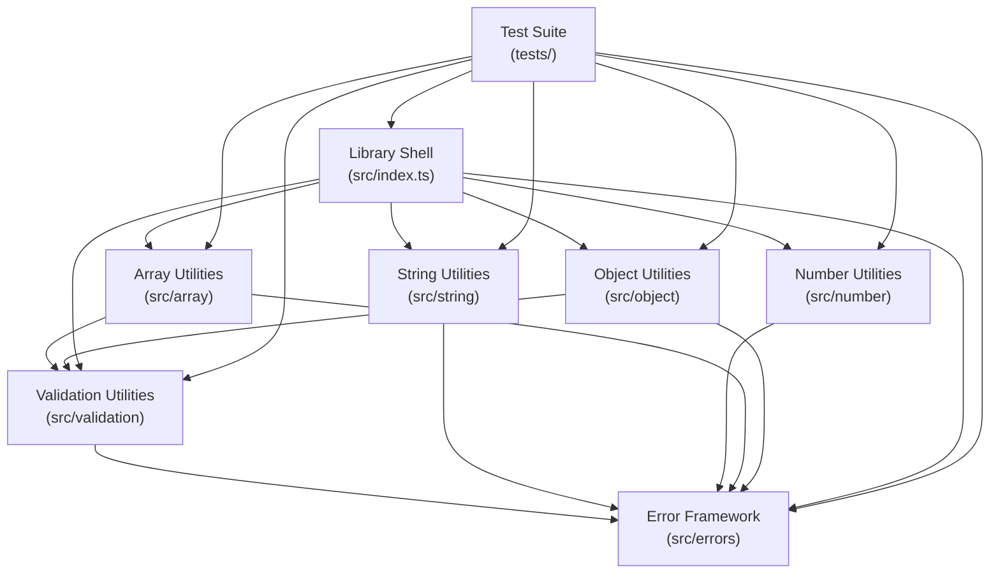

# C4 Component Level: System Overview

## System Components

| Component | Description | Code Elements | Documentation |
|-----------|-------------|---------------|---------------|
| Error Framework | Custom error class hierarchy for all validation failures | 1 file | [c4-component-error-framework.md](./c4-component-error-framework.md) |
| Validation Utilities | Runtime type guards and assertion functions | 1 file | [c4-component-validation-utilities.md](./c4-component-validation-utilities.md) |
| String Utilities | String manipulation functions (capitalize, reverse, slugify, truncate) | 1 file | [c4-component-string-utilities.md](./c4-component-string-utilities.md) |
| Number Utilities | Numeric operation functions (clamp, roundTo) | 1 file | [c4-component-number-utilities.md](./c4-component-number-utilities.md) |
| Array Utilities | Array transformation and set-operation functions | 1 file | [c4-component-array-utilities.md](./c4-component-array-utilities.md) |
| Object Utilities | Object manipulation functions (clone, get, isEmpty, keys, merge, omit, pick) | 1 file | [c4-component-object-utilities.md](./c4-component-object-utilities.md) |
| Library Shell | Public API barrel entry point (src/index.ts) | 1 file | [c4-component-library-shell.md](./c4-component-library-shell.md) |
| Test Suite | 224 Jest tests organized by source domain | 7 files | [c4-component-test-suite.md](./c4-component-test-suite.md) |

## Component Relationships

```mermaid
C4Component
    title Component Diagram for Utility Library (all components)

    Container_Boundary(lib, "Utility Library (TypeScript ESM)") {
        Component(shell, "Library Shell", "TypeScript Barrel", "Public API entry point")
        Component(errors, "Error Framework", "TypeScript Classes", "Custom error hierarchy")
        Component(validation, "Validation Utilities", "TypeScript Functions", "Type guards and assertions")
        Component(string, "String Utilities", "TypeScript Functions", "String manipulation")
        Component(number, "Number Utilities", "TypeScript Functions", "Numeric operations")
        Component(array, "Array Utilities", "TypeScript Functions", "Array transformations")
        Component(object, "Object Utilities", "TypeScript Functions", "Object manipulation")
        Component(tests, "Test Suite", "Jest/TypeScript", "224 tests across all domains")
    }

    Rel(validation, errors, "throws EmptyStringError")
    Rel(string, errors, "throws EmptyStringError, InvalidNumberError")
    Rel(number, errors, "throws InvalidNumberError, OutOfRangeError")
    Rel(array, errors, "throws InvalidNumberError")
    Rel(object, errors, "throws ValidationError")
    Rel(array, validation, "uses isPositiveNumber, isNonNegativeInteger")
    Rel(object, validation, "uses isPlainObject")
    Rel(shell, errors, "re-exports")
    Rel(shell, validation, "re-exports")
    Rel(shell, string, "re-exports")
    Rel(shell, number, "re-exports")
    Rel(shell, array, "re-exports")
    Rel(shell, object, "re-exports")
    Rel(tests, shell, "smoke tests entry point")
    Rel(tests, errors, "tests error classes")
    Rel(tests, validation, "tests type guards")
    Rel(tests, string, "tests string functions")
    Rel(tests, number, "tests numeric functions")
    Rel(tests, array, "tests array functions")
    Rel(tests, object, "tests object functions")
```

## Full Dependency Graph

The following diagram shows all import relationships between components. Arrows represent "depends on / imports from" direction.

```mermaid
flowchart TD
    errors["Error Framework\n(src/errors)"]
    validation["Validation Utilities\n(src/validation)"]
    string["String Utilities\n(src/string)"]
    number["Number Utilities\n(src/number)"]
    array["Array Utilities\n(src/array)"]
    object["Object Utilities\n(src/object)"]
    shell["Library Shell\n(src/index.ts)"]
    tests["Test Suite\n(tests/)"]

    validation --> errors
    string --> errors
    number --> errors
    array --> errors
    array --> validation
    object --> errors
    object --> validation
    shell --> errors
    shell --> validation
    shell --> string
    shell --> number
    shell --> array
    shell --> object
    tests --> shell
    tests --> errors
    tests --> validation
    tests --> string
    tests --> number
    tests --> array
    tests --> object
```

## Component-to-Code Mapping

| c4-code-*.md file | Component |
|-------------------|-----------|
| [c4-code-errors.md](./c4-code-errors.md) | [Error Framework](./c4-component-error-framework.md) |
| [c4-code-validation.md](./c4-code-validation.md) | [Validation Utilities](./c4-component-validation-utilities.md) |
| [c4-code-string.md](./c4-code-string.md) | [String Utilities](./c4-component-string-utilities.md) |
| [c4-code-number.md](./c4-code-number.md) | [Number Utilities](./c4-component-number-utilities.md) |
| [c4-code-array.md](./c4-code-array.md) | [Array Utilities](./c4-component-array-utilities.md) |
| [c4-code-object.md](./c4-code-object.md) | [Object Utilities](./c4-component-object-utilities.md) |
| [c4-code-src.md](./c4-code-src.md) | [Library Shell](./c4-component-library-shell.md) |
| [c4-code-tests.md](./c4-code-tests.md) | [Test Suite](./c4-component-test-suite.md) |
| [c4-code-tests-errors.md](./c4-code-tests-errors.md) | [Test Suite](./c4-component-test-suite.md) |
| [c4-code-tests-validation.md](./c4-code-tests-validation.md) | [Test Suite](./c4-component-test-suite.md) |
| [c4-code-tests-string.md](./c4-code-tests-string.md) | [Test Suite](./c4-component-test-suite.md) |
| [c4-code-tests-number.md](./c4-code-tests-number.md) | [Test Suite](./c4-component-test-suite.md) |
| [c4-code-tests-array.md](./c4-code-tests-array.md) | [Test Suite](./c4-component-test-suite.md) |
| [c4-code-tests-object.md](./c4-code-tests-object.md) | [Test Suite](./c4-component-test-suite.md) |
