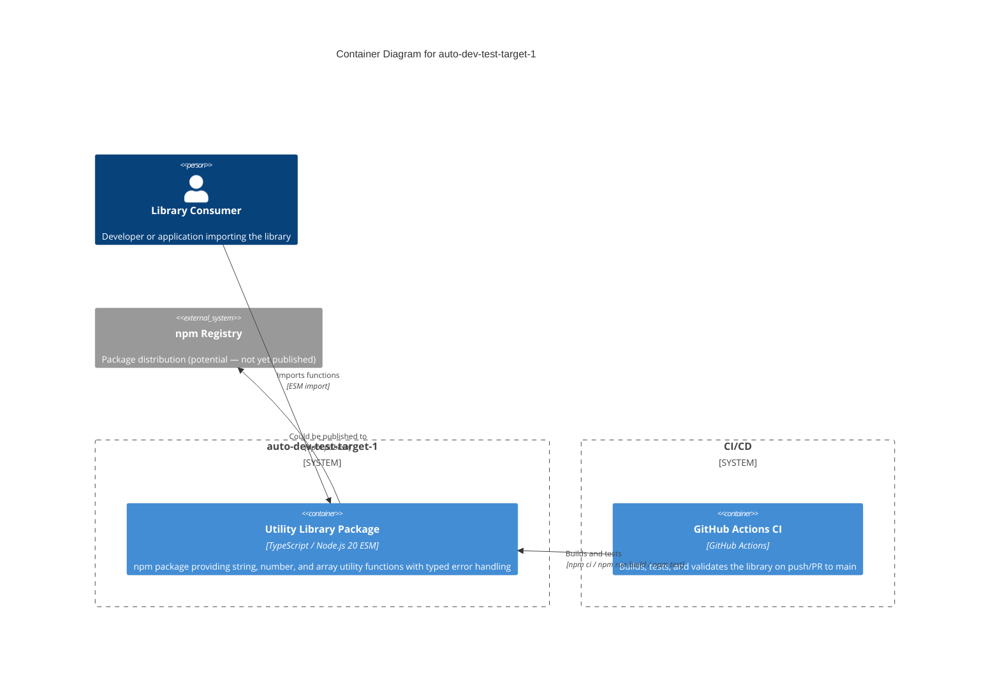

# C4 Container Level: System Deployment

## Container Diagram

## Containers

### Utility Library Package

- **Name**: auto-dev-test-target-1
- **Description**: A minimal TypeScript utility library distributed as an npm package. Provides string, number, and array manipulation functions with a typed error framework. Not a running service — consumed as a dependency by other applications.
- **Type**: Library (npm package)
- **Technology**: TypeScript 5.x, Node.js 20.x, ESM modules
- **Deployment**: Distributed as an npm package (`dist/` compiled output). Not deployed as a running process. Inferred from `package.json` entry point (`dist/index.js`).

#### Purpose

This is the sole deployable artifact of the system. It compiles TypeScript source into JavaScript ESM modules with type declarations, producing a `dist/` directory that can be consumed via `npm install` or direct import. The package aggregates all five components (String Utilities, Number Utilities, Array Utilities, Error Framework, Library Shell) into a single distributable unit.

#### Components Deployed

- **String Utilities** — [c4-component-string-utilities.md](./c4-component-string-utilities.md)
- **Number Utilities** — [c4-component-number-utilities.md](./c4-component-number-utilities.md)
- **Array Utilities** — [c4-component-array-utilities.md](./c4-component-array-utilities.md)
- **Error Framework** — [c4-component-error-framework.md](./c4-component-error-framework.md)
- **Library Shell** — [c4-component-library-shell.md](./c4-component-library-shell.md)

#### Interfaces

- **Library Root API**: ESM module exports — no network API
  - `capitalize(str)`, `reverse(str)`, `slugify(str)`, `truncate(str, maxLength, suffix?)` — String operations
  - `clamp(value, min, max)`, `roundTo(value, decimals)` — Number operations
  - `first(arr)`, `last(arr)`, `unique(arr)`, `chunk(arr, size)`, `compact(arr)`, `flatten(arr, depth?)`, `intersection(...arrays)` — Array operations
  - `ValidationError`, `EmptyStringError`, `InvalidNumberError`, `OutOfRangeError` — Error classes
  - `isNonEmptyString()`, `isPositiveNumber()`, `isInRange()`, `isNonNegativeInteger()`, `assertNonEmptyString()` — Validation guards

> **Note**: This container does not expose a network API (HTTP, gRPC, etc.). It is a library consumed via ESM imports. No OpenAPI specification is applicable.

#### Dependencies

- No runtime dependencies on other containers or external systems
- **Dev-time only**: Jest 30.x, ts-jest 29.x, TypeScript 5.x (devDependencies)

#### Infrastructure

- **Config**: [`package.json`](../../package.json) (entry points, scripts), [`tsconfig.json`](../../tsconfig.json) (compilation)
- **CI/CD**: [`.github/workflows/ci.yml`](../../.github/workflows/ci.yml) — GitHub Actions pipeline (build + test on push/PR to main)
- **Scaling**: N/A (library, not a running service)
- **Resources**: N/A

---

### GitHub Actions CI

- **Name**: GitHub Actions CI
- **Description**: Continuous integration pipeline that validates the library on every push and pull request to the main branch.
- **Type**: CI/CD Pipeline
- **Technology**: GitHub Actions, Ubuntu latest, Node.js 20
- **Deployment**: GitHub-hosted runner (ephemeral)

#### Purpose

Ensures code quality by running the full build-and-test cycle on every code change. Steps: checkout → setup Node.js 20 with npm cache → `npm ci` → `npm run build` (TypeScript compilation) → `npm test` (Jest test suite).

#### Components Deployed

- None directly — this container validates all components indirectly via build and test

#### Interfaces

- **Trigger**: GitHub webhook events (push to main, PRs targeting main)
- **Output**: Pass/fail status checks on PRs

#### Dependencies

- **Utility Library Package**: Builds and tests it
- **GitHub**: Hosted runner infrastructure
- **npm Registry**: Downloads devDependencies during `npm ci`

#### Infrastructure

- **Config**: [`.github/workflows/ci.yml`](../../.github/workflows/ci.yml)
- **Scaling**: On-demand (GitHub-hosted runners)
- **Resources**: Ephemeral Ubuntu container with Node.js 20

## External Systems

- **npm Registry**: Package dependency source (devDependencies downloaded during install/CI). Potential future distribution target for the library itself.
- **GitHub**: Source code hosting, CI/CD runner infrastructure, PR status checks.

## Container-Component Mapping

| Container | Components |
|-----------|-----------|
| Utility Library Package | String Utilities, Number Utilities, Array Utilities, Error Framework, Library Shell |
| GitHub Actions CI | (validates all components via build + test) |
