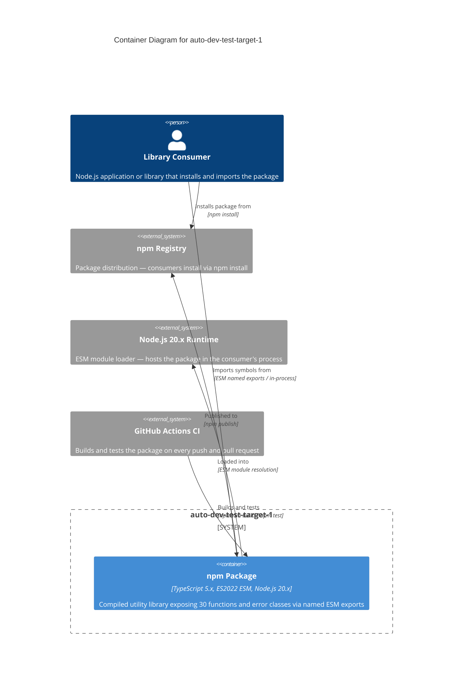

# C4 Container Level: System Deployment

## Containers

### npm Package (Compiled Library)

- **Name**: npm Package (Compiled Library)
- **Description**: The single deployable unit of the system — a compiled TypeScript ESM library distributed as an npm package and consumed by other Node.js applications via direct import. No process is started; the package is loaded into the consumer's runtime.
- **Type**: Library Package
- **Technology**: TypeScript 5.x compiled to ES2022 ESM (Node.js 20.x)
- **Deployment**: npm registry distribution; consumed via `npm install`

## Purpose

`auto-dev-test-target-1` is a pure utility library. It does not start a server, run a background worker, or expose a network interface of any kind. The single container is the compiled npm package: a set of `.js` and `.d.ts` files in the `dist/` directory, published to an npm registry and installed by downstream consumers. When a consumer calls `import { clamp } from 'auto-dev-test-target-1'`, Node.js loads this package into the consumer's process — no additional processes are spawned.

All seven source components (Error Framework, Validation Utilities, String Utilities, Number Utilities, Array Utilities, Object Utilities, and Library Shell) are bundled into this single package. They are not independently deployable and have no separate runtime footprint.

## Components

This container deploys the following components:

| Component | Source Path | Description |
|-----------|-------------|-------------|
| Library Shell | `src/index.ts` | Public API entry point — re-exports all 30 public symbols |
| Error Framework | `src/errors/` | Custom error class hierarchy (`ValidationError`, `EmptyStringError`, `InvalidNumberError`, `OutOfRangeError`) |
| Validation Utilities | `src/validation/` | Runtime type guards and assertion functions |
| String Utilities | `src/string/` | String transformation functions (`capitalize`, `reverse`, `slugify`, `truncate`) |
| Number Utilities | `src/number/` | Numeric operation functions (`clamp`, `roundTo`) |
| Array Utilities | `src/array/` | Array transformation and set-operation functions |
| Object Utilities | `src/object/` | Object manipulation functions (`clone`, `get`, `isEmpty`, `keys`, `merge`, `omit`, `pick`) |

Component documentation:
- [c4-component-library-shell.md](./c4-component-library-shell.md)
- [c4-component-error-framework.md](./c4-component-error-framework.md)
- [c4-component-validation-utilities.md](./c4-component-validation-utilities.md)
- [c4-component-string-utilities.md](./c4-component-string-utilities.md)
- [c4-component-number-utilities.md](./c4-component-number-utilities.md)
- [c4-component-array-utilities.md](./c4-component-array-utilities.md)
- [c4-component-object-utilities.md](./c4-component-object-utilities.md)

## Interfaces

No network APIs exist. This system is a library consumed via direct imports.

### Package Entry Point (ESM Named Exports)

- **Protocol**: ES Module named exports (in-process function calls)
- **Description**: All 30 public symbols exposed at the package root (`dist/index.js`)
- **Specification**: No API specifications — this system is a library consumed via direct imports.
- **Exported Symbols**:
  - Errors: `ValidationError`, `EmptyStringError`, `InvalidNumberError`, `OutOfRangeError`
  - Validation: `isNonEmptyString`, `isPositiveNumber`, `isInRange`, `isNonNegativeInteger`, `assertNonEmptyString`, `isPlainObject`
  - String: `capitalize`, `reverse`, `slugify`, `truncate`
  - Number: `clamp`, `roundTo`
  - Array: `chunk`, `compact`, `first`, `last`, `unique`, `flatten`, `intersection`
  - Object: `clone`, `get`, `isEmpty`, `keys`, `merge`, `omit`, `pick`

### Submodule Deep Imports

- **Protocol**: ES Module named exports (in-process function calls)
- **Description**: Each submodule also exposes its own barrel for deep imports (e.g., `import { clamp } from 'auto-dev-test-target-1/dist/number/index.js'`)
- **Paths**: `dist/errors/`, `dist/validation/`, `dist/string/`, `dist/number/`, `dist/array/`, `dist/object/`

## Dependencies

### Containers Used

None. This library has no runtime dependencies on other containers or services.

### External Systems

| External System | Role | Integration Type |
|----------------|------|-----------------|
| npm Registry | Package distribution | Publish (`npm publish`) / Install (`npm install`) |
| Node.js 20.x | Runtime host | ESM module loader — hosts the package in the consumer's process |
| TypeScript 5.x | Build toolchain | Compile-time type checking (`tsc`) |
| GitHub Actions CI | Build and test pipeline | CI pipeline — runs `npm run build` and `npm test` on every push/PR |

## Build Output Details

- **Build command**: `npm run build` (invokes `tsc`)
- **Output directory**: `dist/`
- **Key artifacts**:
  - `dist/index.js` — Compiled ES2022 ESM entry point
  - `dist/index.d.ts` — TypeScript declaration file (public API types)
  - `dist/errors/`, `dist/validation/`, `dist/string/`, `dist/number/`, `dist/array/`, `dist/object/` — Compiled submodule directories with `.js` and `.d.ts` files
- **Module format**: ES2022 ESM (`"type": "module"`, `"module": "NodeNext"` in tsconfig)
- **Package entry points**:
  - `"main": "dist/index.js"` — CommonJS/ESM entrypoint
  - `"types": "dist/index.d.ts"` — TypeScript declarations

## Infrastructure

- **Deployment Config**: No Dockerfile, Kubernetes manifest, or PaaS config exists. Distribution is via npm registry.
- **CI Pipeline**: `.github/workflows/ci.yml` — GitHub Actions workflow running on `ubuntu-latest` with Node.js 20; executes `npm ci`, `npm run build`, `npm test` on every push and pull request to `main`.
- **Scaling**: Not applicable — library packages scale with the consumer's process.
- **Resources**: Not applicable — no standalone process; resource consumption is determined by the consumer application.

## Container-Component Mapping

All source components deploy into the single npm package container:

| Container | Components | Deployment Rationale |
|-----------|-----------|----------------------|
| npm Package (Compiled Library) | Library Shell, Error Framework, Validation Utilities, String Utilities, Number Utilities, Array Utilities, Object Utilities | All components are compiled together by `tsc` into the `dist/` directory and distributed as a single npm package. They share the same process as the consumer application. |

The Test Suite component is **not included** in the container — it is a development and CI artifact only, executed by `npm test` in development and CI environments, never deployed to consumers.

## Container Diagram

```mermaid
C4Container
    title Container Diagram for auto-dev-test-target-1

    Person(consumer, "Library Consumer", "Node.js application or library that installs and imports the package")

    System_Boundary(system, "auto-dev-test-target-1") {
        Container(pkg, "npm Package", "TypeScript 5.x, ES2022 ESM, Node.js 20.x", "Compiled utility library exposing 30 functions and error classes via named ESM exports")
    }

    System_Ext(npm, "npm Registry", "Package distribution — consumers install via npm install")
    System_Ext(node, "Node.js 20.x Runtime", "ESM module loader — hosts the package in the consumer's process")
    System_Ext(ci, "GitHub Actions CI", "Builds and tests the package on every push and pull request")

    Rel(consumer, pkg, "Imports symbols from", "ESM named exports / in-process")
    Rel(pkg, npm, "Published to", "npm publish")
    Rel(consumer, npm, "Installs package from", "npm install")
    Rel(pkg, node, "Loaded into", "ESM module resolution")
    Rel(ci, pkg, "Builds and tests", "npm run build / npm test")
```
