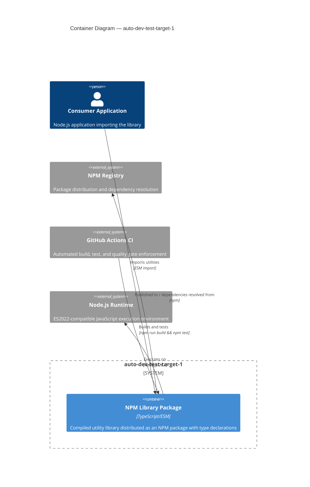

# C4 Container Level: auto-dev-test-target-1

## Container Diagram

```mermaid
C4Container
    title Container Diagram — auto-dev-test-target-1

    Person(consumer, "Consumer Application", "Node.js application importing the library")

    System_Boundary(system, "auto-dev-test-target-1") {
        Container(npmPkg, "NPM Library Package", "TypeScript/ESM", "Compiled utility library distributed as an NPM package with type declarations")
    }

    System_Ext(npm, "NPM Registry", "Package distribution and dependency resolution")
    System_Ext(ghActions, "GitHub Actions CI", "Automated build, test, and quality gate enforcement")
    System_Ext(nodeRuntime, "Node.js Runtime", "ES2022-compatible JavaScript execution environment")

    Rel(consumer, npmPkg, "Imports utilities", "ESM import")
    Rel(npmPkg, nodeRuntime, "Executes on", "Node.js 20.x")
    Rel(ghActions, npmPkg, "Builds and tests", "npm run build && npm test")
    Rel(npmPkg, npm, "Published to / dependencies resolved from", "npm")
```

## Containers

### NPM Library Package

| Attribute | Value |
|---|---|
| **Name** | NPM Library Package |
| **Description** | A compiled TypeScript utility library providing string, number, array, object, promise, and function utilities with a structured error hierarchy and validation layer |
| **Type** | Library (inferred — no explicit deployment infrastructure) |
| **Technology** | TypeScript 5.x compiled to ESM JavaScript (ES2022 target, NodeNext module resolution) |
| **Deployment** | Consumed via `npm install auto-dev-test-target-1` in consumer projects |
| **Purpose** | Provide reusable, type-safe utility functions for JavaScript/TypeScript projects |

#### Components Deployed

| Component | Description | Code Elements |
|---|---|---|
| Core Infrastructure | Error hierarchy and validation utilities | `src/errors`, `src/validation` |
| Primitive Utilities | String and number transformations | `src/string`, `src/number` |
| Collection Utilities | Array and object manipulation | `src/array`, `src/object` |
| Async & Control Flow | Promise helpers and function wrappers | `src/promise`, `src/function` |
| Package Infrastructure | Build config and barrel export | `package.json`, `tsconfig.json`, `src/index.ts` |

#### Interfaces

This is a library consumed via direct ESM imports. There are no network APIs.

**Public API surface** (`src/index.ts` barrel export):
- 5 error classes: `ValidationError`, `EmptyStringError`, `InvalidNumberError`, `OutOfRangeError`, `TimeoutError`
- 7 validation functions: `isNonEmptyString`, `isPositiveNumber`, `isInRange`, `isNonNegativeInteger`, `isNonNegative`, `isPlainObject`, `assertNonEmptyString`
- 4 string functions: `reverse`, `truncate`, `slugify`, `capitalize`
- 2 number functions: `clamp`, `roundTo`
- 7 array functions: `first`, `last`, `unique`, `chunk`, `compact`, `flatten`, `intersection`
- 7 object functions: `clone`, `get`, `isEmpty`, `keys`, `merge`, `omit`, `pick`
- 3 promise functions: `sleep`, `retry`, `timeout`
- 3 function wrappers: `once`, `debounce`, `throttle`

**Total**: 38 exported symbols

#### Dependencies

| Dependency | Type | Purpose |
|---|---|---|
| typescript ^5.3.0 | devDependency | TypeScript compiler |
| jest ^30.2.0 | devDependency | Test runner |
| ts-jest ^29.4.6 | devDependency | TypeScript Jest transformer |
| @types/jest ^30.0.0 | devDependency | Jest type definitions |
| @types/node ^20.10.0 | devDependency | Node.js type definitions |

No runtime dependencies. All dependencies are development-only.

#### Build Output

| Attribute | Value |
|---|---|
| **Build command** | `tsc` (via `npm run build`) |
| **Output directory** | `dist/` |
| **Artifacts** | Compiled `.js` files + `.d.ts` type declarations |
| **Module format** | ESM (NodeNext) targeting ES2022 |
| **Entry point** | `dist/index.js` (main), `dist/index.d.ts` (types) |

#### Infrastructure

| Resource | Details |
|---|---|
| **CI Pipeline** | `.github/workflows/ci.yml` — GitHub Actions on `ubuntu-latest` with Node.js 20 |
| **CI Triggers** | Push to `main`, pull requests to `main` |
| **CI Steps** | `npm ci` → `npm run build` → `npm test` |
| **Container/Docker** | None |
| **Kubernetes** | None |
| **Terraform** | None |

## External Systems

| System | Description | Interaction |
|---|---|---|
| GitHub Actions CI | Automated CI pipeline | Builds and tests the library on every push/PR to main |
| NPM Registry | Package distribution | Resolves devDependencies; potential publish target |
| Node.js Runtime | Execution environment | Consumer applications run on Node.js 20.x+ with ESM support |

## Container-Component Mapping

| Container | Component | Code Elements |
|---|---|---|
| NPM Library Package | Core Infrastructure | `src/errors`, `src/validation`, `tests/errors`, `tests/validation` |
| NPM Library Package | Primitive Utilities | `src/string`, `src/number`, `tests/string`, `tests/number` |
| NPM Library Package | Collection Utilities | `src/array`, `src/object`, `tests/array`, `tests/object` |
| NPM Library Package | Async & Control Flow | `src/promise`, `src/function`, `tests/promise`, `tests/function` |
| NPM Library Package | Package Infrastructure | `package.json`, `tsconfig.json`, `src/index.ts`, `tests/index.test.ts` |
