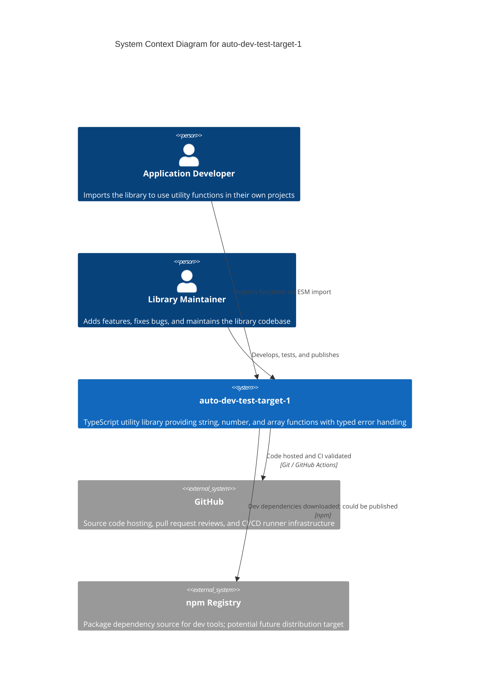

# C4 Context Level: System Context

## System Overview

### Short Description

A TypeScript utility library providing string, number, and array manipulation functions with typed error handling for JavaScript/TypeScript applications.

### Long Description

auto-dev-test-target-1 is a lightweight, zero-dependency utility library that developers import into their own Node.js or TypeScript applications. It provides common data manipulation operations — transforming strings, constraining numbers, and working with arrays — so that application teams don't have to rewrite these patterns from scratch.

The library emphasizes safety through a built-in error framework. Every function validates its inputs and throws descriptive, typed errors (such as `EmptyStringError` or `OutOfRangeError`) rather than returning silent failures. TypeScript type guards allow consumers to validate data at runtime while keeping full type safety.

The library is distributed as a compiled npm package. It has no runtime dependencies and no network footprint — it runs entirely within the consuming application's process. Quality is maintained through a GitHub Actions CI pipeline that builds and tests every change.

## System Context Diagram

## Personas

### Application Developer
- **Type**: Human User
- **Description**: A developer building a Node.js or TypeScript application who needs common data manipulation utilities without writing them from scratch.
- **Goals**: Import reliable, well-typed utility functions; handle edge cases safely with descriptive errors; reduce boilerplate code in their own projects.
- **Key Features Used**: String Manipulation, Number Operations, Array Utilities, Input Validation

### Library Maintainer
- **Type**: Human User
- **Description**: A developer responsible for evolving the library — adding new utilities, fixing bugs, and ensuring quality through CI. In this project, development is orchestrated by the auto-dev-mcp automation system.
- **Goals**: Add new utility functions following established patterns; maintain test coverage and CI health; keep the library reliable and well-documented.
- **Key Features Used**: Error Framework, all utility modules, CI Pipeline

### GitHub Actions CI
- **Type**: Programmatic User
- **Description**: Automated pipeline triggered on every push and pull request to the main branch. Builds TypeScript, runs the full Jest test suite, and reports pass/fail status.
- **Goals**: Validate that every code change compiles and passes all tests before merging.
- **Key Features Used**: All modules (indirectly, via build and test)

## System Features

| Feature | Description | Personas | Components |
|---------|-------------|----------|------------|
| String Manipulation | Transform strings: capitalize, reverse, create URL slugs, truncate with suffix | Application Developer | String Utilities |
| Number Operations | Constrain numbers to ranges and round to specific decimal places | Application Developer | Number Utilities |
| Array Utilities | Manipulate arrays: access first/last elements, deduplicate, chunk, compact, flatten, find intersections | Application Developer | Array Utilities |
| Input Validation | Validate data at runtime with type guards and assertion functions that narrow TypeScript types | Application Developer | Error Framework |
| Typed Error Handling | Throw descriptive, categorized errors (empty string, invalid number, out of range) instead of generic failures | Application Developer | Error Framework |
| Continuous Integration | Automatically build and test every code change via GitHub Actions | Library Maintainer | CI Pipeline |

## User Journeys

### String Manipulation — Application Developer Journey

1. **Install**: Add the library as a dependency (`npm install auto-dev-test-target-1`)
2. **Import**: Import the needed function (`import { slugify } from 'auto-dev-test-target-1'`)
3. **Use**: Call the function with input data (`slugify('Hello World')` returns `'hello-world'`)
4. **Handle errors**: If input is invalid (e.g., negative maxLength for truncate), catch the typed error (`InvalidNumberError`) and display a meaningful message

### Array Utilities — Application Developer Journey

1. **Import**: Import array functions (`import { chunk, unique } from 'auto-dev-test-target-1'`)
2. **Transform data**: Split a list into pages (`chunk(items, 10)`) or remove duplicates (`unique(ids)`)
3. **Chain operations**: Combine utilities — compact an array to remove nulls, then chunk the result for pagination
4. **Handle edge cases**: Empty arrays return safely (empty result, not errors); invalid parameters throw `InvalidNumberError`

### Input Validation — Application Developer Journey

1. **Import**: Import a type guard (`import { isNonEmptyString } from 'auto-dev-test-target-1'`)
2. **Validate**: Check user input at a system boundary (`if (isNonEmptyString(input)) { ... }`)
3. **Benefit from types**: Inside the `if` block, TypeScript knows the value is a `string` — no cast needed
4. **Assert when confident**: Use `assertNonEmptyString(value)` to throw `EmptyStringError` if validation fails

### Feature Development — Library Maintainer Journey

1. **Read design docs**: Review requirements and implementation plan from `comms/inbox/`
2. **Implement**: Write the new utility function with TypeScript types and input validation
3. **Test**: Add comprehensive Jest tests covering happy paths, edge cases, and error conditions
4. **Submit PR**: Push the branch and create a pull request targeting main
5. **CI validates**: GitHub Actions builds and runs all tests; fix any failures
6. **Merge**: Squash-merge the PR once CI passes; the new function is available in the library

## External Systems and Dependencies

### GitHub
- **Type**: Service (code hosting + CI/CD)
- **Description**: Hosts the source code repository, manages pull requests, and provides the CI/CD runner infrastructure
- **Integration**: Git protocol for code; GitHub Actions webhooks for CI triggers
- **Purpose**: Version control, code review, and automated quality validation on every change

### npm Registry
- **Type**: Package registry
- **Description**: Public registry for JavaScript/TypeScript packages
- **Integration**: npm CLI during `npm ci` (dependency installation)
- **Purpose**: Source for development dependencies (TypeScript, Jest, ts-jest). The library itself is not yet published but is structured for future npm distribution.

## Related Documentation
- [Container Architecture](./c4-container.md)
- [Component Architecture](./c4-component.md)
