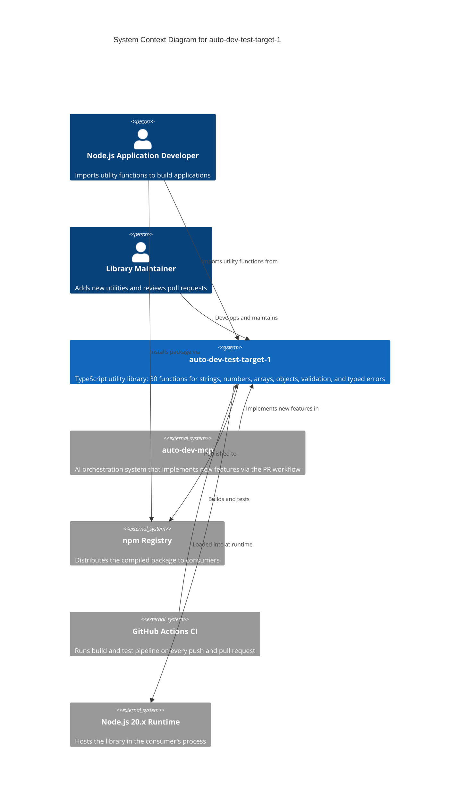

# C4 Context Level: System Context

## System Overview

### Short Description

`auto-dev-test-target-1` is a TypeScript utility library that provides 30 reusable functions for string manipulation, number operations, array transformations, object manipulation, runtime type validation, and structured error handling.

### Long Description

`auto-dev-test-target-1` is a minimal, pure utility library written in TypeScript and distributed as an npm package. It has no runtime dependencies and does not run as a server or service — it is loaded directly into the consumer's Node.js process at import time. The library solves the everyday problem of missing safe, well-typed utility functions in JavaScript: safely checking strings, clamping numbers, deep-merging objects, deduplicating arrays, and converting untrusted values into typed results. It exposes 30 named exports across six domains (string, number, array, object, validation, errors) through a single package entry point. The library is developed with automated continuous integration via GitHub Actions, and its feature development is orchestrated by the auto-dev-mcp automation system.

## Personas

### Node.js Application Developer

- **Type**: Human User
- **Description**: A software developer building a Node.js application or library who wants battle-tested utility functions without pulling in a heavy dependency like lodash.
- **Goals**: Import specific utility functions, get full TypeScript type safety, handle validation errors predictably.
- **Key Features Used**: String Utilities, Number Utilities, Array Utilities, Object Utilities, Validation Utilities, Error Framework

### Library Maintainer

- **Type**: Human User
- **Description**: The developer or team responsible for adding new utility functions, fixing bugs, and evolving the library's API.
- **Goals**: Add new utilities, ensure all 224 tests pass, keep TypeScript types accurate, merge PRs cleanly.
- **Key Features Used**: All features (as implementer); GitHub Actions CI for quality assurance

### auto-dev-mcp (Automated Development Agent)

- **Type**: Programmatic User
- **Description**: An AI-powered MCP orchestration system that reads design documents from `comms/inbox/`, implements new utility functions, runs the full PR lifecycle, and writes completion reports to `comms/outbox/`. It is the primary mechanism by which new features are added to this library.
- **Goals**: Implement new utilities as specified in design documents; create PRs; verify CI passes; merge changes automatically.
- **Key Features Used**: All library features (as author); GitHub Actions CI; Git/GitHub PR workflow

### GitHub Actions CI

- **Type**: Programmatic User
- **Description**: The automated build and test pipeline that runs on every push and pull request to the `main` branch. It verifies the library compiles and all tests pass before any changes are merged.
- **Goals**: Ensure `npm run build` succeeds; ensure all 224 Jest tests pass; block broken code from merging.
- **Key Features Used**: Entire library (build and test verification)

## System Features

### String Utilities

- **Description**: Functions to transform text — capitalize the first letter, reverse a string, convert text to URL-safe slugs, and truncate strings to a maximum length.
- **Users**: Node.js Application Developer, Library Maintainer, auto-dev-mcp
- **Functions**: `capitalize`, `reverse`, `slugify`, `truncate`

### Number Utilities

- **Description**: Functions for safe numeric operations — clamp a value within a min/max range, and round a number to a specified decimal precision.
- **Users**: Node.js Application Developer, Library Maintainer, auto-dev-mcp
- **Functions**: `clamp`, `roundTo`

### Array Utilities

- **Description**: Functions for common array operations — safe first/last element access, deduplication, chunking into fixed-size groups, removing falsy values, flattening nested arrays, and finding the intersection of multiple arrays.
- **Users**: Node.js Application Developer, Library Maintainer, auto-dev-mcp
- **Functions**: `first`, `last`, `unique`, `chunk`, `compact`, `flatten`, `intersection`

### Object Utilities

- **Description**: Functions for working with plain objects — deep clone, nested property access by dot-path, check emptiness, list keys, deep merge multiple objects, omit named keys, and pick named keys.
- **Users**: Node.js Application Developer, Library Maintainer, auto-dev-mcp
- **Functions**: `clone`, `get`, `isEmpty`, `keys`, `merge`, `omit`, `pick`

### Validation Utilities

- **Description**: Runtime type guards and assertion functions that narrow TypeScript types — check for non-empty strings, positive numbers, non-negative integers, values within a range, and plain objects. Assertions throw typed errors on failure.
- **Users**: Node.js Application Developer, Library Maintainer, auto-dev-mcp
- **Functions**: `isNonEmptyString`, `isPositiveNumber`, `isInRange`, `isNonNegativeInteger`, `assertNonEmptyString`, `isPlainObject`

### Error Framework

- **Description**: A hierarchy of typed error classes that utility functions throw when given invalid input. Consumers can catch and identify specific failure modes by error type or field name.
- **Users**: Node.js Application Developer, Library Maintainer, auto-dev-mcp
- **Classes**: `ValidationError`, `EmptyStringError`, `InvalidNumberError`, `OutOfRangeError`

## User Journeys

### Library Integration — Node.js Application Developer

1. Developer identifies a need for a utility function (e.g., slug generation, deep object merge).
2. Developer runs `npm install auto-dev-test-target-1` — note: the package is currently at v0.1.0 alpha and not yet published to the public npm registry; installation works from the local file system or a private registry.
3. Developer adds an import: `import { slugify, merge } from 'auto-dev-test-target-1'`.
4. Developer calls the function with their data: `slugify('Hello World')` returns `'hello-world'`.
5. If the input is invalid (e.g., empty string), the function throws a typed error such as `EmptyStringError`.
6. Developer catches the typed error and handles the failure case explicitly.
7. TypeScript narrows the return type, providing IDE autocomplete and compile-time safety throughout.

### Automated Feature Development — auto-dev-mcp

1. auto-dev-mcp reads a feature specification placed in `comms/inbox/` describing a new utility function (e.g., `merge()`).
2. The agent reads the implementation plan and requirements documents.
3. The agent writes source code in `src/<domain>/` and test code in `tests/<domain>/`.
4. The agent runs `npm run build` to verify TypeScript compilation succeeds.
5. The agent runs `npm test` to verify all tests pass (including the new ones).
6. The agent commits the changes and pushes a feature branch.
7. The agent creates a pull request via `gh pr create`.
8. GitHub Actions CI runs the build and test pipeline automatically.
9. If CI passes, the agent merges the PR via `gh pr merge --squash --delete-branch`.
10. The agent writes a completion report to `comms/outbox/`.

### Continuous Integration — GitHub Actions CI

1. A developer or auto-dev-mcp pushes a commit or opens a pull request targeting `main`.
2. GitHub Actions triggers the CI workflow defined in `.github/workflows/ci.yml`.
3. The workflow installs dependencies via `npm ci` on an `ubuntu-latest` runner with Node.js 20.
4. The workflow runs `npm run build` — if TypeScript compilation fails, the pipeline fails and the PR is blocked.
5. The workflow runs `npm test` — if any of the 224 Jest tests fail, the pipeline fails and the PR is blocked.
6. On success, the PR is marked as passing and is eligible for merge.

### Type-Safe Validation — Node.js Application Developer

1. Developer receives an untrusted value (e.g., from user input or an API response).
2. Developer calls a type guard: `if (isNonEmptyString(value)) { ... }` — TypeScript narrows `value` to `string` inside the block.
3. Alternatively, developer calls an assertion: `assertNonEmptyString(value, 'username')` — if the value is not a non-empty string, an `EmptyStringError` is thrown with `field = 'username'`.
4. Developer catches `EmptyStringError` (or the `ValidationError` base class) to provide user-friendly error messages.

## External Systems and Dependencies

### npm Registry

- **Type**: Package Registry
- **Description**: The npm registry where the compiled library package is published and from which consumers install it.
- **Integration Type**: Publish (`npm publish`) / Install (`npm install`)
- **Purpose**: Package distribution to downstream consumers. Note: the package is currently at v0.1.0 alpha and not confirmed as published to the public npm registry.

### GitHub Actions CI

- **Type**: CI/CD Service
- **Description**: GitHub's hosted automation service that runs the build and test pipeline on every push and pull request.
- **Integration Type**: Automated pipeline triggered by Git events
- **Purpose**: Quality gate — ensures the library compiles and all tests pass before any code is merged to `main`.

### Node.js 20.x

- **Type**: Runtime Environment
- **Description**: The JavaScript runtime that loads and executes the compiled library within the consumer's process.
- **Integration Type**: ESM module resolution (in-process)
- **Purpose**: Hosts the library at runtime; the library targets Node.js 20.x with ES2022 ESM module format.

### TypeScript 5.x Compiler

- **Type**: Build Toolchain
- **Description**: The TypeScript compiler (`tsc`) that transforms TypeScript source into JavaScript ESM and generates `.d.ts` declaration files.
- **Integration Type**: Build-time compile step
- **Purpose**: Produces the distributable `dist/` artifacts and enforces type correctness.

## System Context Diagram

```mermaid
C4Context
    title System Context Diagram for auto-dev-test-target-1

    Person(developer, "Node.js Application Developer", "Imports utility functions to build applications")
    Person(maintainer, "Library Maintainer", "Adds new utilities and reviews pull requests")
    System(library, "auto-dev-test-target-1", "TypeScript utility library: 30 functions for strings, numbers, arrays, objects, validation, and typed errors")
    System_Ext(autodev, "auto-dev-mcp", "AI orchestration system that implements new features via the PR workflow")
    System_Ext(npm, "npm Registry", "Distributes the compiled package to consumers")
    System_Ext(ci, "GitHub Actions CI", "Runs build and test pipeline on every push and pull request")
    System_Ext(node, "Node.js 20.x Runtime", "Hosts the library in the consumer's process")

    Rel(developer, library, "Imports utility functions from")
    Rel(maintainer, library, "Develops and maintains")
    Rel(autodev, library, "Implements new features in")
    Rel(library, npm, "Published to")
    Rel(developer, npm, "Installs package via")
    Rel(ci, library, "Builds and tests")
    Rel(library, node, "Loaded into at runtime")
```

## Related Documentation

- [Container Documentation](./c4-container.md)
- [Component Documentation](./c4-component.md)
