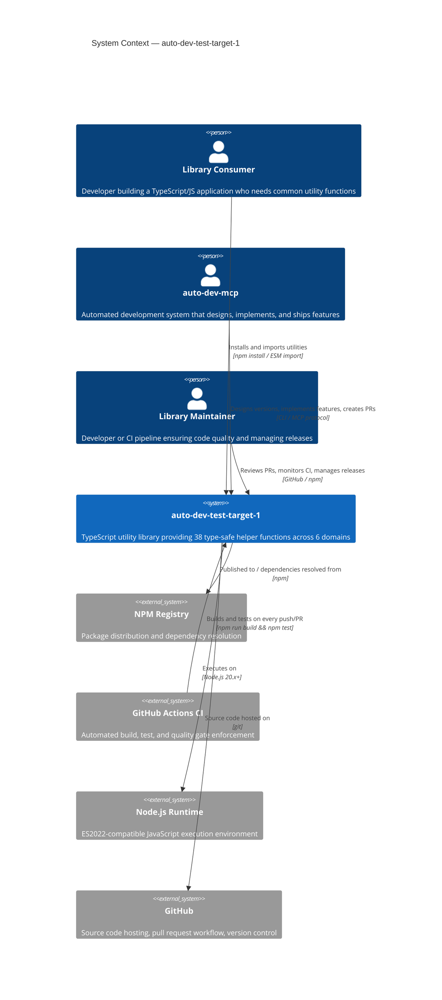

# C4 Context Level: auto-dev-test-target-1

## System Overview

**Short description**: A TypeScript utility library providing type-safe string, number, array, object, promise, and function helpers for JavaScript/TypeScript projects.

**Long description**: auto-dev-test-target-1 is a zero-dependency TypeScript utility library that provides 38 reusable functions across six domains: string manipulation, number processing, array operations, object manipulation, promise helpers, and function wrappers. It includes a structured error hierarchy and input validation layer. The library is compiled to ESM (ES2022) and consumed via NPM. It is currently in alpha and serves as a test target for auto-dev-mcp integration testing. Development is orchestrated by auto-dev-mcp, with GitHub Actions enforcing quality gates on every change.

## Context Diagram

```mermaid
C4Context
    title System Context — auto-dev-test-target-1

    Person(developer, "Library Consumer", "Developer building a TypeScript/JS application who needs common utility functions")
    Person(autodev, "auto-dev-mcp", "Automated development system that designs, implements, and ships features")
    Person(maintainer, "Library Maintainer", "Developer or CI pipeline ensuring code quality and managing releases")

    System(lib, "auto-dev-test-target-1", "TypeScript utility library providing 38 type-safe helper functions across 6 domains")

    System_Ext(npm, "NPM Registry", "Package distribution and dependency resolution")
    System_Ext(ghActions, "GitHub Actions CI", "Automated build, test, and quality gate enforcement")
    System_Ext(nodeRuntime, "Node.js Runtime", "ES2022-compatible JavaScript execution environment")
    System_Ext(github, "GitHub", "Source code hosting, pull request workflow, version control")

    Rel(developer, lib, "Installs and imports utilities", "npm install / ESM import")
    Rel(autodev, lib, "Designs versions, implements features, creates PRs", "CLI / MCP protocol")
    Rel(maintainer, lib, "Reviews PRs, monitors CI, manages releases", "GitHub / npm")

    Rel(lib, npm, "Published to / dependencies resolved from", "npm")
    Rel(lib, nodeRuntime, "Executes on", "Node.js 20.x+")
    Rel(ghActions, lib, "Builds and tests on every push/PR", "npm run build && npm test")
    Rel(lib, github, "Source code hosted on", "git")
```

## Personas

### 1. Library Consumer

| Attribute | Detail |
|---|---|
| **Type** | End User (Developer) |
| **Description** | A JavaScript or TypeScript developer who installs the library to use its utility functions in their own application |
| **Goals** | Reduce boilerplate code; use well-tested, type-safe utilities; avoid reinventing common operations |
| **Key Features** | String manipulation, number processing, array operations, object manipulation, promise helpers, function wrappers, input validation, structured errors |

### 2. auto-dev-mcp

| Attribute | Detail |
|---|---|
| **Type** | Programmatic User (Automated System) |
| **Description** | An AI-powered orchestration system that designs version plans, implements features via themes, creates pull requests, and monitors CI outcomes |
| **Goals** | Deliver new utilities per backlog priorities; maintain quality gates; progress through the version roadmap |
| **Key Features** | Version planning (backlog items), theme-based implementation, PR lifecycle management, quality gate enforcement |

### 3. Library Maintainer

| Attribute | Detail |
|---|---|
| **Type** | Maintainer (Human Developer / CI) |
| **Description** | A human developer or automated CI pipeline responsible for code quality, test coverage, and release management |
| **Goals** | Ensure all code compiles and tests pass; enforce conventional commits; manage package publishing |
| **Key Features** | CI pipeline (build + test), PR review workflow, quality gates, package infrastructure |

## System Features

| # | Feature | Description | Personas | Components |
|---|---|---|---|---|
| 1 | String Manipulation | Reverse, truncate, slugify, and capitalize strings | Consumer | Primitive Utilities |
| 2 | Number Processing | Clamp values to ranges and round to decimal precision | Consumer | Primitive Utilities |
| 3 | Array Operations | Extract first/last elements, deduplicate, chunk, compact, flatten, and intersect arrays | Consumer | Collection Utilities |
| 4 | Object Manipulation | Clone, deep-merge, pick/omit keys, check emptiness, get nested properties, and extract typed keys | Consumer | Collection Utilities |
| 5 | Promise Helpers | Sleep/delay execution, retry failed operations, and timeout long-running promises | Consumer | Async & Control Flow |
| 6 | Function Wrappers | Ensure single execution (once), debounce rapid calls, and throttle invocation frequency | Consumer | Async & Control Flow |
| 7 | Input Validation | Type-guard functions for strings, numbers, ranges, integers, and plain objects | Consumer, Maintainer | Core Infrastructure |
| 8 | Structured Error Hierarchy | Typed error classes (ValidationError, EmptyStringError, InvalidNumberError, OutOfRangeError, TimeoutError) for predictable error handling | Consumer | Core Infrastructure |
| 9 | Automated Development | AI-orchestrated version planning, theme implementation, and PR lifecycle via auto-dev-mcp | auto-dev-mcp | Package Infrastructure |
| 10 | Continuous Integration | Automated build and test on every push/PR via GitHub Actions | Maintainer, auto-dev-mcp | Package Infrastructure |

## User Journeys

### Journey 1: Library Integration (Library Consumer)

> **Note**: The library is currently in alpha status and not yet published to NPM. The install step below represents the intended workflow once published.

1. **Discover** — Developer identifies a need for common utility functions in their TypeScript project
2. **Install** — Runs `npm install auto-dev-test-target-1` to add the library as a dependency
3. **Import** — Adds ESM imports: `import { slugify, retry, pick } from 'auto-dev-test-target-1'`
4. **Use** — Calls utility functions with full TypeScript type safety and autocompletion
5. **Handle errors** — Catches typed errors (e.g., `InvalidNumberError`) for predictable error handling
6. **Validate inputs** — Uses guard functions like `isNonEmptyString()` to validate data at system boundaries

### Journey 2: Automated Development (auto-dev-mcp)

1. **Plan version** — auto-dev-mcp reads backlog items (e.g., BL-032 through BL-037 for v006) and designs a version plan with themes
2. **Design theme** — Groups related backlog items (e.g., promise utilities) into an implementation theme
3. **Execute theme** — Spawns a CLI agent that implements features, writes tests, and creates a PR
4. **Verify quality** — GitHub Actions CI runs `npm run build` and `npm test` on the PR
5. **Fix failures** — If CI fails, the agent diagnoses and fixes issues (up to 3 attempts)
6. **Merge** — On CI success, the PR is squash-merged to main and the theme is marked complete
7. **Document** — Generates completion reports and retrospectives for each theme

### Journey 3: Quality Assurance (Library Maintainer)

1. **Monitor CI** — Observes GitHub Actions results on incoming PRs
2. **Review changes** — Inspects code changes, test coverage, and conventional commit messages
3. **Enforce gates** — Ensures TypeScript compiles without errors and all 285 tests pass
4. **Manage releases** — Updates package version and publishes to NPM when ready (not yet active)

## External Systems and Dependencies

| System | Type | Interaction |
|---|---|---|
| NPM Registry | Package distribution | Resolves devDependencies during install; intended publish target (not yet active) |
| GitHub Actions CI | Automation | Runs build and test pipeline on every push/PR to main (`ubuntu-latest`, Node.js 20) |
| Node.js Runtime | Execution environment | Consumer applications execute on Node.js 20.x+ with ESM support |
| GitHub | Source code hosting | Hosts repository, manages PRs, enforces branch protection |
| TypeScript Compiler | Build tool | Compiles `.ts` source to `.js` + `.d.ts` output (devDependency only) |
| Jest | Test framework | Executes 285 tests across all utility domains (devDependency only) |

**Runtime dependencies**: None. All dependencies are development-only.

## Related Documentation

- [Container Level](c4-container.md) — Deployment architecture and API surface
- [Component Level](c4-component.md) — Internal component structure and relationships
- Component details: [Core](c4-component-core.md) | [Primitives](c4-component-primitives.md) | [Collections](c4-component-collections.md) | [Async](c4-component-async.md) | [Package](c4-component-package.md)
